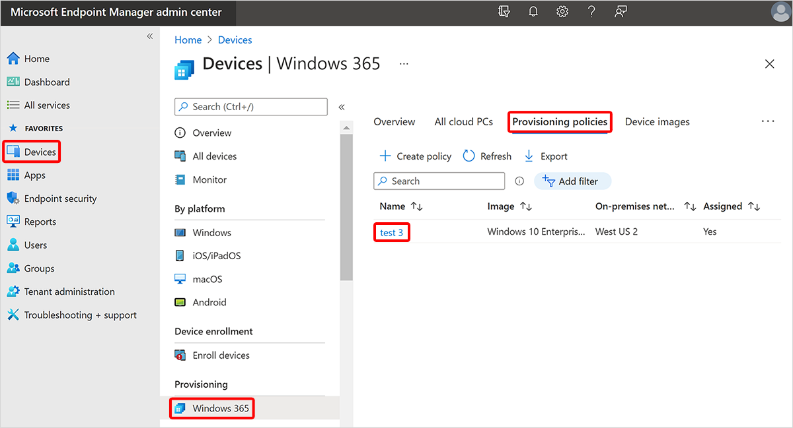

---
# required metadata
title: Edit provisioning policies for Windows 365
titleSuffix:
description: Learn how to edit provisioning policies for Windows 365.
keywords:
author: ErikjeMS  
ms.author: erikje
manager: dougeby
ms.date: 07/23/2021
ms.topic: how-to
ms.service: cloudpc
ms.subservice:
ms.localizationpriority: high
ms.technology:
ms.assetid: 

# optional metadata

#ROBOTS:
#audience:

ms.reviewer: mattsha
ms.suite: ems
search.appverid: MET150
#ms.tgt_pltfrm:
ms.custom: intune-azure; get-started
ms.collection: M365-identity-device-management
---

# Edit provisioning policies

You can update provisioning policies to change assignments or key attributes, like image and network connection.

1. Sign in to the [Microsoft Endpoint Manager admin center](https://go.microsoft.com/fwlink/?linkid=2109431), select **Devices** > **Windows 365** (under **Provisioning**) > **Provisioning policies** > select a policy.

2. On the policy page, you can edit the **General** information, **Image**, and **Assignments** by selecting **Edit** next to each header.

If you change the on-premises network connection or image in a provisioning policy, no change will occur for previously provisioned Cloud PCs. Newly provisioned Cloud PCs will honor the changes in your provisioning policy. To change the previously provisioned Cloud PCs to align with the changes, you must reprovision those Cloud PCs.

If you edit the name of the provisioning policy in the **General** information, the following will occur:

- Any Cloud PC in the All Cloud PCs node will have the new policy name updated in the Provisioning policy column.
- New Cloud PCs created from the provisioning policy will have the new name registered as the device’s enrollmentProfileName in Azure Active Directory and Microsoft Intune. The enrollmentProfileName property for existing Cloud PCs won't change. If you followed the steps to [create a dynamic device group containing all Cloud PCs](create-dynamic-device-group-all-cloudpcs.md) from a specific provisioning policy, edit the dynamic device group and add a new rule so that the group contains both the existing Cloud PCs and any new Cloud PCs from the provisioning policy:

  - **Property** = enrollmentProfileName
  - **Operator** = Equals
  - **Value** = \<New name for provisioning policy\>

If you assign new users to the provisioning policy, and these users have a valid Cloud PC license, provisioning will automatically occur. If you remove users from the provisioning policy assignment, the [grace period](device-management-overview.md#column-details) will be triggered.

## Next steps

[Learn about the automated provisioning steps](automated-provisioning-steps.md).
