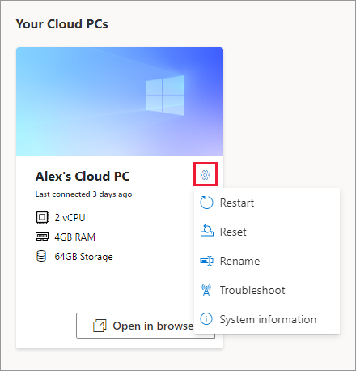
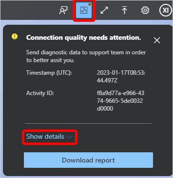
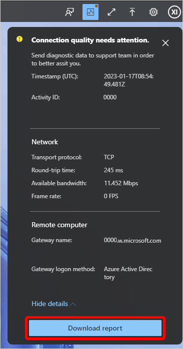
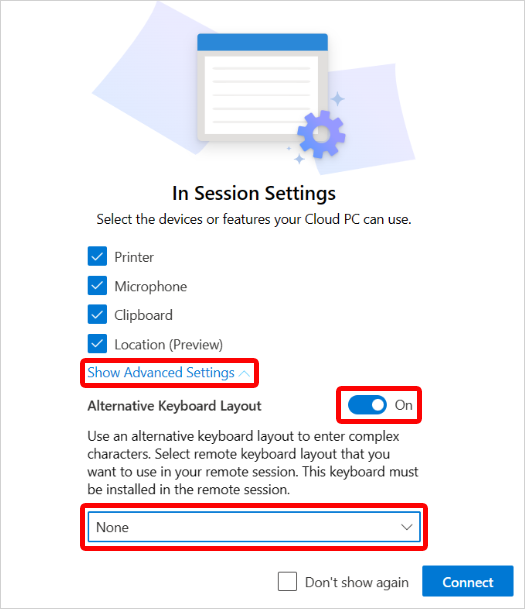
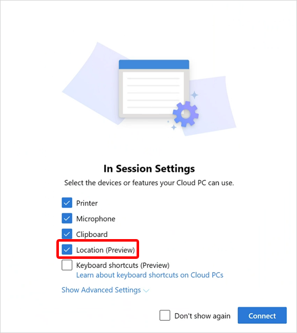

---
# required metadata
title: Accessing Cloud PCs
titleSuffix:
description: Learn how users can access their Cloud PC.
keywords:
author: ErikjeMS  
ms.author: erikje
manager: dougeby
ms.date: 08/11/2023
ms.topic: how-to
ms.service: windows-365
ms.subservice:
ms.localizationpriority: high
ms.technology:
ms.assetid: 

# optional metadata

#ROBOTS:
#audience:

ms.reviewer: ivivano
ms.suite: ems
search.appverid: MET150
#ms.tgt_pltfrm:
ms.custom: intune-azure; get-started
ms.collection:
- M365-identity-device-management
- tier1
---

# Access a Cloud PC

Users can access their Cloud PCs in these ways:

- [Windows 365 app](https://support.microsoft.com/topic/cbb0d4d5-69d4-4f00-b050-6dc7a02d02d0 )
- [windows365.microsoft.com](https://Windows365.microsoft.com) web client
- Microsoft Remote Desktop

For information on hardware requirements, see [End user hardware requirements](end-user-hardware-requirements.md).

## Windows 365 web site

Users can navigate to [windows365.microsoft.com](https://windows365.microsoft.com) to access their Cloud PCs.  

### Software requirements

To access their Cloud PC from this website, the user's device must meet the following requirements:

- Supported operating systems: Windows, macOS, ChromeOS, Linux
- A modern browser like Microsoft Edge, Google Chrome, Safari, Mozilla Firefox (v55.0 and later), or LG webOS 23.

### Home page

On their Windows 365 home page, users see the Cloud PCs they have access to in the **Your Cloud PCs** section.

From this page, users have two options to connect to your Cloud PC:

- Select **Open in browser** to open their Cloud PC in the web client (not available for mobile devices). For more information, see [Windows 365 web client](#windows-365-web-client).
- Select **Open in Remote Desktop app** to open their Cloud PC in Remote Desktop. For more information, see [Remote Desktop](#remote-desktop).

### User actions

While on windows365.microsoft.com, users can take actions on their Cloud PCs by selecting the gear icon on a Cloud PC card.

- **Rename**: Changes the name of the Cloud PC shown to the user on the web site. This action doesn't affect any name in Microsoft Intune, Azure Active Directory, on the device, or in the Remote Desktop Apps.
- **Reset**:
  - Reinstalls Windows (with the option to choose between Windows 11 and Windows 10).
  - Removes your personal files.
  - Removes any changes you made to settings.
  - Removes your apps.

    > [!IMPORTANT]  
    > Before resetting your Cloud PC, make sure to back up any important files you need to keep to a cloud storage service or external storage. Resetting your Cloud PC will delete these files.

- **Restart**: Restarts the Cloud PC.
- **Troubleshoot**: Troubleshoot and attempt to resolve any issues that may be preventing a user from connecting to their Cloud PC. The checks run include:
    - Check whether any files or agents required for connectivity are correctly installed.
    - Make sure that the Azure resources are available.

  | Return state | Description |
  | ------------- | ------------- |
  | No issues detected | None of the checks discovered an issue with the Cloud PC. |
  | Issues resolved  | An issue was detected and fixed. |
  | Can’t connect to Cloud PC. We’re working to fix it, try again later. | A Microsoft service required for connectivity is unavailable. Try connecting again later. |
  | We couldn’t fix issues with your Cloud PC. Contact your administrator. | An issue was detected but it couldn't be fixed. This issue exists because of an ongoing Windows update or another issue. If this error persists for an extended period of time, the Cloud PC may need to be reset. |
- **System Information**: Displays information about the Cloud PC specification.

## Windows 365 web client

When you select **Open in browser** for a Cloud PC on the windows365.microsoft.com [web site](#windows-365-web-site), the **In Session Settings** window appears, where you can choose multiple options before connecting to your Cloud PC:

1. Select which devices and features on your physical device that your Cloud PC can access:
    - Printer
    - Microphone
    - Clipboard
    - [Location (preview)](#location-preview)
2. Select **Show advanced settings** to see the following options:
    - [Alternative keyboard layout](#alternative-keyboard-layout)
3. Select **Connect**. The Cloud PC opens in the web client (browser).

### User feedback

Users can provide feedback about their Cloud PC experience by using the feedback icon in the upper right corner.

### Connection details

Users can view and download connection details.

1. Select the **Connection details** icon > **Show details**.
  
     

2. To download a text file containing the connection details, select **Download report**.
  
     

### Transfer files to and from a Cloud PC

To transfer files from the local device to the Cloud PC, select the upload icon to launch File Explorer. Select the files to transfer them to the \This PC\Windows365 virtual drive\Uploads folder on the Cloud PC.

To transfer files from the Cloud PC to the local device, copy the files to the Downloads folder on the Cloud PC. The files will be copied to the \This PC\Windows365 virtual drive\Downloads folder of the local device.

#### Restrict users from transferring files to and from Cloud PCs

You can restrict users from transferring files by using RDP drive redirection. For more information, see [Manage RDP device redirections for Cloud PCs](./enterprise/manage-rdp-device-redirections.md).

### Collect user logs

Users can collect logs of their Cloud PC sessions. The logs are collected from the browser and the user can choose the save location.

To turn on log collection, in the client, select the gear icon > **Capture logs**.

   

### Hardware acceleration

You can turn on hardware acceleration when using the web client to access your Cloud PC. This option decreases network latency, improving the web client Cloud PC experience. This option is turned on by default.

To turn hardware acceleration on or off, in the client, select the gear icon > **Use hardware acceleration**.

### High DPI

You can use the **High DPI** toggle to render the web client using the native resolution of the end user device.

### Alternative keyboard layout

Use this option if you're using a nonstandard keyboard that includes special characters (like Chinese (Traditional) or Spanish (Mexico)).

1. In the Windows 365 web client **In Session Settings** window, choose **Show advanced settings** > **Alternative keyboard layout** > **On**.

   
2. In the drop-down list, select the language that matches the keyboard.

By default, **Alternative keyboard layout** is turned off. If using a standard keyboard that doesn't require special layouts, the user can deselect this option. Deselecting the option in the middle of a session requires reconnecting.

### Location (preview)

Location redirection lets Cloud PCs access your approximate location safely without privacy concerns. By turning on the location service, you let your Cloud PC use the location of your physical device for most apps (the Weather widget isn’t currently supported).

For more information about location services, see [Windows location service and privacy](https://support.microsoft.com/en-us/windows/windows-location-service-and-privacy-3a8eee0a-5b0b-dc07-eede-2a5ca1c49088).

To turn on location redirection, follow these steps:

1. On your physical device, go to **Settings** > **Privacy & Security** > **Location**.
2. For **Location services**, set the toggle to **On**.
3. For **Let apps access your location**, set the toggle to **On**.
4. For each app that you want your Cloud PC to have location information, set the toggle to **On**.
5. Go to windows365.microsoft.com.
6. Under **Your Cloud PCs**, select **Open in a browser** for your Cloud PC.
7. Under **In Session Settings**, select **Location (Preview)** > **Connect**.

     
8. In the **windows365.microsoft.com wants to Know your location** confirmation box, select **Allow**.

Organizational settings might override the location settings for your device. For example, your organization might disable location redirection for all Cloud PCs they manage.

### Keyboard shortcuts (preview)

While accessing your Cloud PC using the web client, you can set your Cloud PCs to use special keyboard shortcuts (combination keys with the Windows key, ESC, and so on). For a full list of shortcuts, see [Keyboard shortcuts in Windows](https://support.microsoft.com/en-us/windows/keyboard-shortcuts-in-windows-dcc61a57-8ff0-cffe-9796-cb9706c75eec).

Keyboard shortcuts are  in [public preview](public-preview.md).

To turn on keyboard shortcuts for your Cloud PC:

1. Go to windows365.microsoft.com.
2. Under **Your Cloud PCs**, select **Open in a browser** for your Cloud PC.
3. Under **In Session Settings**, select **Keyboard shortcuts (Preview)** > **Connect**.
   :::image type="content" source="media/end-user-access-cloud-pc/keyboard-shortcuts.png" alt-text="Screencap of In Sessions Settings Keyboard shortcuts." lightbox="media/end-user-access-cloud-pc/keyboard-shortcuts.png":::

When **Keyboard shortcuts** is turned on, the web client opens in full-screen mode. Keyboard shortcuts only work in full-screen mode. Full screen using F11 isn't supported. You must use the full screen mode from the toolbar.

To turn off keyboard shortcuts, in your web client, select **Settings** > **In session** > deselect **Keyboard shortcuts** > **Update**.

### Dark mode

To switch the windows365.microsoft.com site to dark mode:

1. Go to windows365.microsoft.com.
2. Select the settings icon and select **Dark Mode**.

     

## Remote Desktop

The Microsoft Remote Desktop app lets users access and control a remote PC, including a Cloud PC.

For a list of clients by operating system, see [Remote Desktop clients](/windows-server/remote/remote-desktop-services/clients/remote-desktop-clients). For a comparison of features by client, see [Compare the clients: features](/windows-server/remote/remote-desktop-services/clients/remote-desktop-features#client-features).

### Install the Microsoft Remote Desktop app

To set up their Remote Desktop client, users follow these steps:

1. Download the Remote Desktop app from the [Remote Desktop clients page](/windows-server/remote/remote-desktop-services/clients/remote-desktop-clients).
2. Select **Subscribe**.
3. Enter their Azure Active Directory credentials.
4. The Cloud PC appears in the list, and they can double-click it to launch.

<!-- ########################## -->
## Next steps

For information about the different protocol network requirements per scenario, see [Network requirements](./enterprise/requirements-network.md).
