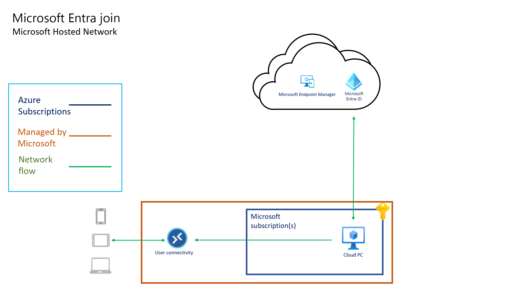
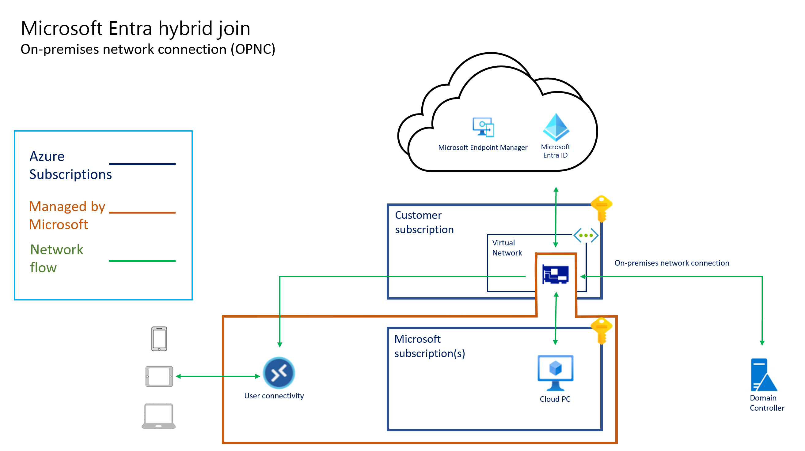

---
# required metadata
title: Windows 365 architecture
titleSuffix:
description: Windows 365 architecture
keywords:
author: ErikjeMS  
ms.author: erikje
manager: dougeby
ms.date: 07/09/2024
ms.topic: overview
ms.service: windows-365
ms.subservice:
ms.localizationpriority: high
ms.assetid: 

# optional metadata

#ROBOTS:
#audience:

ms.reviewer: thhickli
ms.suite: ems
search.appverid: MET150
#ms.tgt_pltfrm:
ms.custom: intune-azure; get-started
ms.collection:
- M365-identity-device-management
- tier2
---

# Windows 365 architecture

Windows 365 provides a per-user per-month license model by hosting Cloud PCs on behalf of customers in Microsoft Azure. In this model, there’s no need to consider storage, compute infrastructure architecture, or costs. The Windows 365 architecture also lets you use your existing investments in Azure networking and security. Each Cloud PC is provisioned according to the configuration you define in the Windows 365 section of the Microsoft Intune admin center.

## Virtual network connectivity

Each Cloud PC has a virtual network interface card (NIC) in Microsoft Azure. You have two NIC management options:

- If you use Microsoft Entra join and a Microsoft hosted network, you don’t need to bring an Azure subscription or manage the NIC.
- If you bring your own network and use an Azure network connection (ANC), the NICs are created by Windows 365 in your Azure subscription.

The NICs are attached to an Azure Virtual Network based on your [Azure network connection (ANC)](azure-network-connections.md) configuration.

Windows 365 is [supported in many Azure regions](requirements.md#supported-azure-regions-for-cloud-pc-provisioning). You can control which Azure region is used in two ways:

- By selecting the Microsoft-hosted network and an Azure region.
- By selecting an Azure virtual network from your Azure subscription when [creating an ANC](create-azure-network-connection.md).

The Azure virtual network's region determines where the Cloud PC is created and [hosted](architecture.md#hosted-on-behalf-of-architecture).

When using your own virtual network, you can extend access between your current Azure regions to other Azure regions supported by Windows 365. To extend to other regions, you can use Azure [virtual network peering](/azure/architecture/reference-architectures/hybrid-networking/hub-spoke) or [Virtual WAN](/azure/architecture/networking/hub-spoke-vwan-architecture).

By using your own Azure virtual network, Windows 365 lets you use Virtual Network security and routing features, including:

- [Azure Network Security Groups](/azure/virtual-network/network-security-groups-overview)
- [User Defined Routing](/azure/virtual-network/virtual-networks-udr-overview)
- [Azure Firewall](/azure/firewall/overview)
- [Network virtual appliances](https://azure.microsoft.com/blog/best-practices-to-consider-before-deploying-a-network-virtual-appliance/) (NVAs)

> [!TIP]
> For web filtering and network protection for Cloud PCs, consider using the [Network Protection](/microsoft-365/security/defender-endpoint/network-protection) and [Web Protection](/microsoft-365/security/defender-endpoint/web-protection-overview) features of Microsoft Defender for Endpoint. These features can be deployed across both physical and virtual endpoints by using the Microsoft Intune admin center.

## Microsoft Intune integration

[Microsoft Intune](/intune/intune-service/fundamentals/what-is-intune) is used to manage all of your Cloud PCs. Microsoft Intune and associated Windows components have various [network endpoints that must be allowed](/intune/intune-service/fundamentals/intune-endpoints) through the Virtual Network. Apple and Android endpoints may be safely ignored if you don’t use Microsoft Intune for managing those device types.

> [!TIP]
> Be sure to allow access to [Windows Notification Services (WNS)](/intune/intune-service/fundamentals/intune-endpoints#windows-push-notification-services-wns). You might not immediately notice an impact if access is blocked. However, WNS enables Microsoft Intune to trigger actions on Windows endpoints immediately instead of waiting for normal policy polling intervals on those devices or policy polling at startup/logon behavior. WNS [recommends](/windows/uwp/design/shell/tiles-and-notifications/firewall-allowlist-config) direct connectivity from the Windows client to WNS.

You only need to grant access to a subset of endpoints based on your Microsoft Intune tenant location. To find your tenant location (or Azure Scale Unit (ASU)), sign in to the [Microsoft Intune admin center](https://go.microsoft.com/fwlink/?linkid=2109431), choose **Tenant administration** > **Tenant details**. Under **Tenant location**, you’ll see something similar to "North America 0501" or "Europe 0202". The rows in the Microsoft Intune documentation are differentiated by geographic region. Regions are indicated by the first two letters in the names (na = North America, eu = Europe, ap = Asia Pacific). Because tenants may be relocated within a region, it’s best to allow access to an entire region rather than a specific endpoint in that region.

For more information about Microsoft Intune service regions and data location information, see [Data storage and processing in Intune](/intune/intune-service/protect/privacy-data-store-process).

## Identity services

Windows 365 uses both Microsoft Entra ID and on-premises Active Directory Domain Services (AD DS). Microsoft Entra ID provides:

- User authentication for Windows 365 (as with any other Microsoft 365 service).
- Device identity services for Microsoft Intune through Microsoft Entra hybrid join or Microsoft Entra join.

When configuring Cloud PCs to use Microsoft Entra hybrid join, AD DS provides:

- On-premises domain join for the Cloud PCs.
- User authentication for the Remote Desktop Protocol (RDP) connections.

When configuring Cloud PCs to use Microsoft Entra join, Microsoft Entra ID provides:

- The domain join mechanism for the Cloud PCs.
- User authentication for RDP connections.

For more information on how the identity services affect the deployment, management, and usage of Cloud PCs, see [identity and authentication](identity-authentication.md).

### Microsoft Entra ID

Microsoft Entra ID provides user authentication and authorization for both the Windows 365 web portal and for the Remote Desktop client apps. Both support modern authentication, which means Microsoft Entra Conditional Access can be integrated to provide:

- multi-factor authentication
- location-based restrictions
- sign-in risk management
- session limits, including:
  - sign-in frequency for Remote Desktop clients and the Windows 365 web portal
  - cookie persistence for the Windows 365 web portal
- device compliance controls

For more information on how to use Microsoft Entra Conditional Access with Windows 365, see [Set conditional access policies](set-conditional-access-policies.md).

### Active Directory Domain Services

Windows 365 Cloud PCs can be either Microsoft Entra hybrid joined or Microsoft Entra joined. When using Microsoft Entra hybrid join, Cloud PCs must domain join to an AD DS domain. This domain must be synchronized with Microsoft Entra ID. The domain’s domain controllers may be hosted in Azure or on-premises. If hosted on-premises, connectivity must be established from Azure to the on-premises environment. The connectivity can be in the form of [Azure Express Route](/azure/architecture/reference-architectures/hybrid-networking/expressroute) or a [site-to-site VPN](/azure/architecture/reference-architectures/hybrid-networking/vpn). For more information on establish hybrid network connectivity, see [implement a secure hybrid network](/azure/architecture/reference-architectures/dmz/secure-vnet-dmz). The connectivity must allow communication from the Cloud PCs to the domain controllers required by Active Directory. For more information, see [Configure firewall for AD domain and trusts](/troubleshoot/windows-server/identity/config-firewall-for-ad-domains-and-trusts).

## User connectivity

Cloud PC connectivity is provided by Azure Virtual Desktop. No inbound connections direct from the Internet are made to the Cloud PC. Instead, connections are made from:

- The Cloud PC to the Azure Virtual Desktop endpoints.
- The Remote Desktop clients to Azure Virtual Desktop endpoints.

For more information on these ports, see [Azure Virtual Desktop required URL list](/azure/virtual-desktop/safe-url-list). To ease configuration of network security controls, use Service Tags for Azure Virtual Desktop to identity those endpoints. For more information on Azure Service Tags, see [Azure service tags overview](/azure/virtual-network/service-tags-overview).

There's no requirement to configure your Cloud PCs to make these connections. Windows 365 seamlessly integrates Azure Virtual Desktop connectivity components into gallery or custom images.

For more information on the network architecture of Azure Virtual Desktop, see [Understanding Azure Virtual Desktop network connectivity](/azure/virtual-desktop/network-connectivity).

Windows 365 Cloud PCs don't support third-party connection brokers. 

## "Hosted on behalf of" architecture

The "hosted on behalf of" architecture lets Microsoft services, after they’re delegated appropriate and scoped permissions to a virtual network by a subscription owner, attach hosted Azure services to a customer subscription. This connectivity model lets a Microsoft service provide software-as-a-service and user licensed services as opposed to standard consumption-based services.

The following diagrams show the logical architecture for a Microsoft Entra join configuration using a Microsoft hosted network, a Microsoft Entra join configuration using a customer's network connection ("bring your own network"), and a Microsoft Entra hybrid join configuration using an ANC, respectively.

All Cloud PC connectivity is provided by the virtual network interface card. The "hosted on behalf of" architecture means that the Cloud PCs exist in the subscription owned by Microsoft. Therefore, Microsoft incurs the costs for running and managing this infrastructure.

Windows 365 manages the capacity and in-region availability in the Windows 365 subscriptions. Windows 365 determines the size and type of VM based on the [license](cloud-pc-size-recommendations.md) you [assign to the user](assign-licenses.md). Windows 365 determines the Azure region to host your Cloud PCs in based on the virtual network you select when [creating an on-premises network connection](create-azure-network-connection.md).

Windows 365 aligns with Microsoft 365 data protection policies. Customer data within Microsoft's enterprise cloud services is protected by various technologies and processes:

- Various forms of encryption.
- Isolated logically from other tenants.
- Accessible to a limited, controlled, and secured set of users, from specific clients.
- Secured for access using role-based access controls.
- Replicated to multiple servers, storage endpoints, and data centers for redundancy.
- Monitored for unauthorized access, excessive resource consumption, and availability.

For more information about Windows 365 Cloud PC encryption, see [Data encryption in Windows 365](encryption.md).

<!-- ########################## -->
## Next steps

[Learn about Windows 365 identity and authentication](identity-authentication.md).
