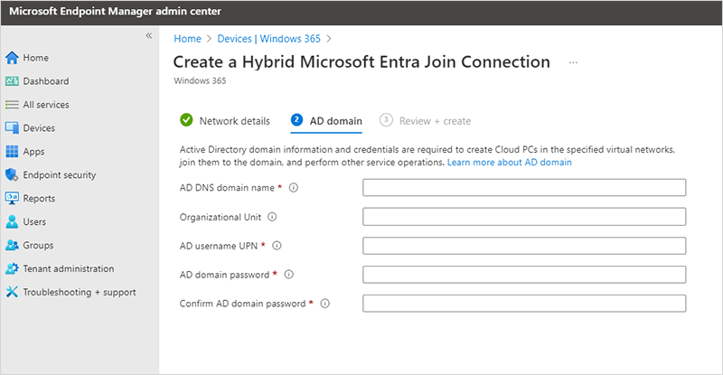

---
# required metadata
title: Azure network connection domain credential life cycle in Windows 365
titleSuffix:
description: Learn about the Azure network connection domain credential life cycle in Windows 365.
keywords:
author: ErikjeMS  
ms.author: erikje
manager: dougeby
ms.date: 02/17/2023
ms.topic: overview
ms.service: windows-365
ms.subservice:
ms.localizationpriority: high
ms.technology:
ms.assetid: 

# optional metadata

#ROBOTS:
#audience:

ms.reviewer: feadeby
ms.suite: ems
search.appverid: MET150
#ms.tgt_pltfrm:
ms.custom: intune-azure; get-started
ms.collection:
- M365-identity-device-management
- tier2
---

# Azure network connection domain credential life cycle

When you create an Azure network connection (ANC) using a hybrid Azure Active Directory (Azure AD) join type, you must include on-premises domain credential information. This requirement makes it possible for the ANC to communicate with your on-premises resources.

This article describes how the on-premises domain credentials are protected and managed by Windows 365 during the whole hybrid Azure AD join ANC life cycle:
 
1. Providing credentials
2. Encrypting credentials
3. Updating credentials
4. Removing credentials

## Provide Azure Active Directory domain credentials

When you [create an ANC](create-azure-network-connection.md), you must provide Azure AD credential information on the AD domain page:

This information includes the Azure AD username and domain password.

## Encryption of domain password information

When the ANC is created, all this information is stored in the Windows 365 service database. The service encrypts the domain password information with a well-protected key before saving it to the database.

- Encryption type: Azure Key Vault certificate
- Key type: RSA-HSM
- Algorithm: RSAOAEP256

This encryption proceeds as follows:

1. The Windows 365 checks the service database for an existing symmetric key specific to that tenant.
2. If a key isn't present or has expired, Windows 365 generates a new symmetric key for this tenant using a random number generator. Keys are created per tenant.
3. If a key already exists for this tenant, it's used in the following steps.
4. After getting the (new or existing) tenant key, Windows 365 decrypts the key with the Windows 365 dedicated Enterprise CA certificate. The certificate is stored in the Azure Key Vault managed by Microsoft.
5. Windows 365 encrypts the password with the decrypted tenant key.
6. The encrypted password is saved to the Windows 365 service database.

### Windows 365 Enterprise certificates

Azure Key Vault certificates are generated and renewed automatically by the Azure Key Vault. Certificates expire after one year. Azure automatically regenerates new versions of certificates three months before the certificate expires. Windows 365 regularly checks the certificate status. When there's a new certificate, Windows 365 re-encrypts the tenant key with the latest certificate.

### Password encryption/decryption algorithm

Windows 365 uses an encrypt-then-MAC approach to encrypt the domain credential with the per tenant key as described in [RFC 7366](https://www.rfc-editor.org/rfc/rfc7366). The same key is used for both encrypting and decrypting the data.

- Encrypt algorithm: Advanced Encryption Standard symmetric-key
- Cipher mode: Cipher-Block-Chaining
- Key length: 256 bit
- Key valid period: 12 months
- Authentication algorithm: HMACSHA256

## Updating credential information

Credentials often change and need updating. Windows 365 doesn’t proactively detect credential changes in your domain. Instead, Windows 365 relies on customers to manually update the ANC with the updated credential information.

When there’s a change to the domain credential of the ANC, the new credential is re-encrypted and updated to the Windows 365 database.

> [!NOTE]  
> If the domain credential is changed in your on-premises Active Directory environment, but you don’t manually update the ANC, Windows 365 will still use the old credential for ANC [health checks](health-checks.md). Therefore, these health checks will fail because the credentials on record are outdated. To make sure this failure doesn’t happen, Edit the Azure network connection](edit-azure-network-connection.md) with the new credentials as soon as possible.

## Removing credential information

After you [delete an ANC](delete-azure-network-connection.md), all the data related to the ANC is immediately and permanently removed from the Windows 365 database.

If the tenant account is deactivated without deleting the ANC, the credential information is retained for 29 days. If the tenant is reactivated within 29 days, the ANC and domain credentials are restored. If the tenant isn't reactivated in 29 days, all ANCs and related information, including credentials, are permanently removed.

<!-- ########################## -->
## Next steps

[Create an Azure network connection](create-azure-network-connection.md).
