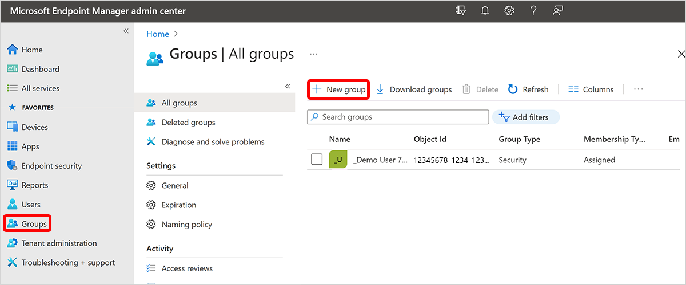

---
# required metadata
title: Create a dynamic device group for containing all Cloud PCs from a specific provisioning policy
titleSuffix:
description: Learn how to create dynamic device groups for Windows 365.
keywords:
author: ErikjeMS  
ms.author: erikje
manager: dougeby
ms.date: 08/02/2021
ms.topic: how-to
ms.service: cloudpc
ms.subservice:
ms.localizationpriority: high
ms.technology:
ms.assetid: 

# optional metadata

#ROBOTS:
#audience:

ms.reviewer: chrimo
ms.suite: ems
search.appverid: MET150
#ms.tgt_pltfrm:
ms.custom: intune-azure; get-started
ms.collection: M365-identity-device-management
---

# Create a dynamic device group containing all Cloud PCs from a specific provisioning policy

You can also apply the same set of policies to all Cloud PCs based on the same image and located in the same region. You can apply policies like this by creating a dynamic device group that contains all Cloud PCs provisioned from a specific provisioning policy.

For the example below, we use "UX Engineering" as the name of the provisioning policy. Anywhere you see "UX Engineering" replace it with the name of your provisioning policy.

In these steps, you’ll use the Enrollment Profile Name and Device Model device property to create the dynamic device group.

1. Sign in to the [Microsoft Endpoint Manager admin center](https://go.microsoft.com/fwlink/?linkid=2109431) > **Groups** > **New Group**.

2. Select the **New Group** page, choose **Security** for **Group type**.
3. Enter the following information:
    1. **Group name** = "All UX Engineering Cloud PC devices"
    2. **Group description** = "A dynamic device group containing all UX Engineering Cloud PC devices."
4. For **Membership type**, choose **Dynamic Device**.
5. Select **Add dynamic query**.
6. On the **Dynamic membership rules** page, enter the following:
    1. **Property** = "enrollmentProfileName"
    2. **Operator** = "Equals"
    3. **Value** = "UX Engineering"
7. If you used the same enrollment profile name for Windows Autopilot, Apple Device Enrollment, or Android Enterprise enrollment, then you may want to filter on Cloud PCs as well. To do so, select **+ Add expression** to create a second query. Enter the following information:
    - **And/Or** = "And"
    - **Property** = "deviceModel"
    - **Operator** = "Contains"
    - **Value** = "Cloud PC"
8. To validate that it works, select **Validate Rules (Preview)** > **Add devices** > select some Cloud PCs that were provisioned from the "UX Engineering" provisioning policy, some Cloud PCs that were provisioned from a different provisioning policy, and some non-Cloud PCs.
9. After the validation completes, select **Save** > **Create**.

<!-- ########################## -->
## Next steps

[Create device configuration profile](create-device-configuration-profile.md).
