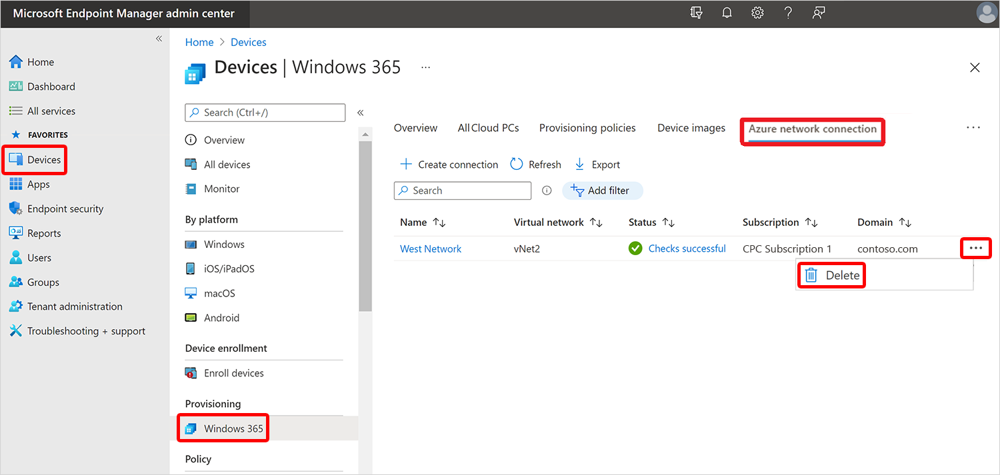

---
# required metadata
title: Delete Azure network connections for Windows 365
titleSuffix:
description: Learn how to delete Azure network connections for Windows 365.
keywords:
author: ErikjeMS  
ms.author: erikje
manager: dougeby
ms.date: 10/30/2024
ms.topic: how-to
ms.service: windows-365
ms.subservice: windows-365-enterprise
ms.localizationpriority: high
ms.assetid: 

# optional metadata

#ROBOTS:
#audience:

ms.reviewer: mattsha
ms.suite: ems
search.appverid: MET150
#ms.tgt_pltfrm:
ms.custom: intune-azure; get-started
ms.collection:
- M365-identity-device-management
- tier2
---

# Delete Azure network connection

Only an unused Azure network connection (ANC) can be deleted.

To delete an unused ANC:

1. Sign in to the [Microsoft Intune admin center](https://go.microsoft.com/fwlink/?linkid=2109431) > **Devices** > **Windows 365** (under **Provisioning**) > **Azure network connection**. You must have [Intune Administrator](/azure/active-directory/roles/permissions-reference#intune-administrator) or [Windows 365 Administrator](/azure/active-directory/roles/permissions-reference) permissions.

2. Select the ellipses (**…**) next to the connection you want to delete > **Delete**.
3. Select **Confirm** when asked to delete the connection.

## In use ANCs

ANCs that are in use can't be deleted. In use ANCs include ANCs that are:

- Referenced by a provisioning policy, including as an alternate ANC.
- Used by a Cloud PC.
- Configured as backup ANCs for [cross region disaster recovery](cross-region-disaster-recovery.md).

If an ANC is in use, then you must take one of the following steps before you can delete it:

- Remove the ANC from all provisioning policies.
- Move Cloud PCs to another ANC or deprovision the Cloud PCs.
- Remove the ANC from all cross region disaster recovery user settings.
- 
<!-- ########################## -->
## Next steps

[Add device images](add-device-images.md).
