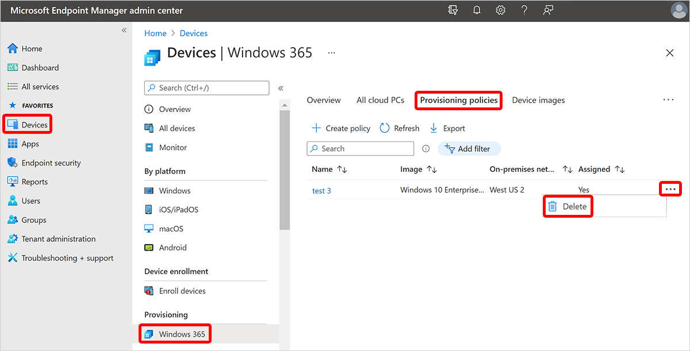

---
# required metadata
title: Delete provisioning policies from Windows 365
titleSuffix:
description: Learn how to delete provisioning policies from Windows 365 devices.
keywords:
author: ErikjeMS  
ms.author: erikje
manager: dougeby
ms.date: 07/25/2024
ms.topic: how-to
ms.service: windows-365
ms.subservice: windows-365-enterprise
ms.localizationpriority: high
ms.assetid: 

# optional metadata

#ROBOTS:
#audience:

ms.reviewer: mattsha
ms.suite: ems
search.appverid: MET150
#ms.tgt_pltfrm:
ms.custom: intune-azure; get-started
ms.collection:
- M365-identity-device-management
- tier2
---

# Delete provisioning policies from Cloud PCs

1. **Only a provisioning policy that has no assignments can be deleted**. Therefore, you must first remove assignments. You can remove assignments by following the steps in [Edit provisioning policy](edit-provisioning-policy.md). After completing those steps, follow the steps below to delete a provisioning policy.
2. Sign in to the [Microsoft Intune admin center](https://go.microsoft.com/fwlink/?linkid=2109431) > **Devices** > **Windows 365** (under **Provisioning**) > **Provisioning policies**.

3. Make sure that **Assigned** is **No**. If **Assigned** state is **Yes**, select the provisioning policy and remove assignments. For Windows 365 Enterprise and Windows 365 Frontline in dedicated mode, if you remove the assignments, the Cloud PCs move into the [grace period](device-management-overview.md) state.
4. Select the ellipses (**…**) next to the policy you want to delete > **Delete**.
5. Select **Confirm** when asked to delete the policy.

<!-- ########################## -->
## Next steps

[Learn more about provisioning](provisioning.md).
