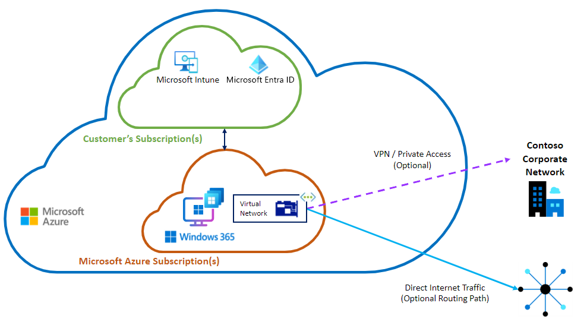
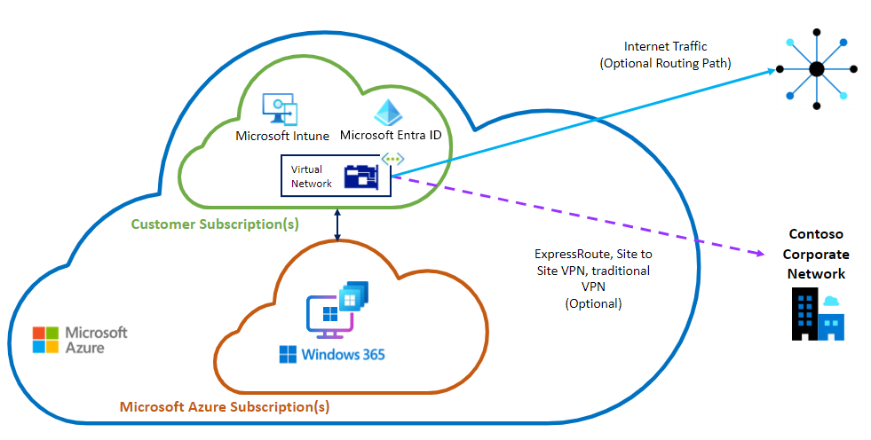
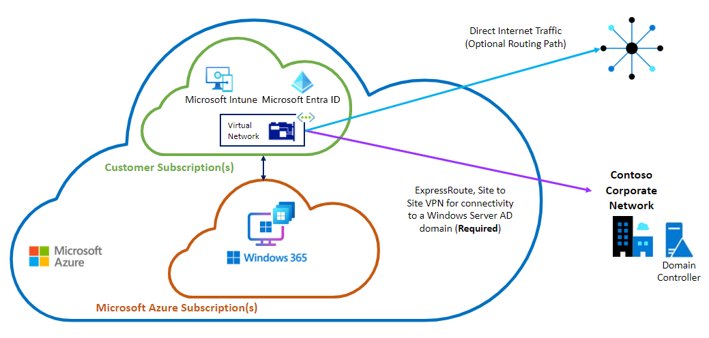

---
# required metadata
title: Windows 365 deployment options
titleSuffix:
description: Learn about Windows 365 deployment options.
keywords:
author: ErikjeMS  
ms.author: erikje
manager: dougeby
ms.date: 12/08/2023
ms.topic: how-to
ms.service: windows-365
ms.subservice:
ms.localizationpriority: high
ms.assetid: 

# optional metadata

#ROBOTS:
#audience:

ms.reviewer: feadebay
ms.suite: ems
search.appverid: MET150
#ms.tgt_pltfrm:
ms.custom: intune-azure; get-started
ms.collection:
- M365-identity-device-management
- tier2
---

# Windows 365 networking deployment options

You have two options for network deployment of the Windows 365 service:

- Use a Microsoft-hosted network
  - Recommended option.
  - Ideal for the Windows 365 Software-as-a-Service (SaaS) features of simplicity, reliability, and scalability.
  - Supports the Microsoft Entra join identity model.
  - No requirement for Azure subscription or expertise.
- Use Azure Network Connections (ANC)
  - Supports both Microsoft Entra join and Microsoft Entra hybrid join identity models.

## Microsoft-hosted network

This option is simple, reliable, and scalable, offering Cloud PC connectivity where Microsoft provides the service in a true SaaS approach. With this option, Microsoft:

- Sets up and fully manages the infrastructure and related services required to deliver functional Cloud PCs to your users.
- Manages the network that the Cloud PCs occupy.
- Provides a Zero Trust Framework-aligned model of an End User Computing (EUC) environment. For more information, see [Learn more about cloud-native endpoints](/intune/solutions/cloud-native-endpoints/cloud-native-endpoints-overview).

The customer’s only responsibility is the configuration and management of the Cloud PCs.

Microsoft recommends that customers use this option for their Windows 365 deployment.

You don’t have to bring in your own Azure subscription(s), plan, design, deploy, or manage the infrastructure. Customers can dedicate their EUC team to focus on managing Cloud PC configurations and security from a single management console provided by Intune.

This option is analogous to providing an employee with a laptop to use at home. You as an organization don’t control the network the device sits on. You do fully control how the Windows device is configured, secured, and how it connects to your on-premises network. With Windows 365, this control is possible thanks to the end-to-end Zero Trust Security Framework-aligned adaptive security controls and configurations.

For example, users can be authenticated with adaptive controls of Microsoft Entra Conditional Access. Corporate connectivity can be delivered by using VPN. Internet security can use a cloud-based secure web gateway (SWG). The advantage is that devices can be deployed at scale in a short timeframe whenever needed on a high bandwidth, resilient network.

### Diagram: Microsoft-hosted network option - Microsoft Entra join only

This diagram shows the Microsoft-hosted network with the Cloud PC and virtual network card within a subscription managed by Microsoft.

### Benefits of the Microsoft-hosted network option

- No Azure subscription is required. Microsoft provides and fully manages the infrastructure required for the Cloud PC to operate. All you need is the required licenses.
- No additional costs for network infrastructure. The Azure costs of operating your own virtual network (VNet) and virtual appliances don’t apply. Microsoft takes care of the network infrastructure.
- No Azure networking expertise or management is required. The VNet is fully managed by Microsoft.
- Low complexity and rapid deployment. There's low complexity in deploying because of minimal dependencies on customer-side elements.
- Zero trust alignment. The Zero Trust model of operation for user, endpoint, workload, and data signals are used for verification rather than applying trust to the network location.
- Simpler troubleshooting and operations. It’s easier to troubleshoot and pinpoint networking issues and adopt modern device management based on Intune policies, security controls, and built-in reporting capabilities.

### Considerations

Before using the Microsoft-hosted network option, review these considerations:

- This option isn’t compatible with the Microsoft Entra hybrid join model. This option is a Cloud-only deployment with no connectivity to on-premises Active Directory Domain Services infrastructure. If you have Group Policy Object-based management policies that can’t be converted to Intune, then this option isn't the right one for you.
- No control of the VNet. The virtual NIC is Microsoft-managed. Therefore, all network controls must be implemented on the Cloud PC itself, similar to physical devices in a work-from-home scenario.
- No direct access to on-premises resources. A VPN or private access solution is required to access these resources. When using VPNs with a Cloud PC, use [split tunneling](https://techcommunity.microsoft.com/t5/windows-365/optimizing-rdp-connectivity-for-windows-365/m-p/3554327) to make sure that RDP traffic isn’t routed through the VPN.
- Requires a cloud native management operation model like Intune.
- Port 25 is blocked.
- Ping/ICMP is blocked.
- Local network communications between Cloud PCs are blocked.
- No direct inbound connectivity is possible to Cloud PCs.
- There's no way for admins to control the IP address ranges and/or address space assigned to the Cloud PCs. Windows 365 handles the IP addresses automatically.

## Azure Network Connection option

With the Azure Network Connection (ANC) deployment option, you’re completely in charge of the VNet and its configuration. If you’re using a Microsoft Entra hybrid join model, you must use this deployment option. This option provides line-of-sight to your on-premises Azure Directory resources and lets you customize network and security goals like:

- Traffic routes.
- Ports and protocols.
- Active Directory  DS and line-of-business application connectivity.
- Gateway connections using VPN or ExpressRoute.
- Address space used by Cloud PCs.
- Communication permissions between Cloud PCs.
- Direct RDP connections to Cloud PCs.

You select the VNet from those in your Azure subscription. You’ll configure provisioning policies that create the Cloud PCs in your vNet. You’ll manage the Cloud PC connectivity, including any direct egress from the VNet and desired internet access path.

Azure Network Connection supports two identity deployment models:

- Microsoft Entra join
- Microsoft Entra hybrid join

### Microsoft Entra join

When using Microsoft Entra join, you’re not required to create a connection from the VNet to your on-premises network. You must merely make sure that there is outbound internet connectivity to the required endpoints. However, you might want to add an on-premises connection for accessing resources located in your on-premises file servers and applications. You can create the connection by using ExpressRoute or site-to-site VPN, but these options present extra cost and complexity.

For simplicity, when using Microsoft Entra join, we recommend that you use the Microsoft-hosted network option previously explained. In that case, you can use a VPN or private access solution over the internet to access corporate resources.

#### Diagram: ANC option - Microsoft Entra join

### Microsoft Entra hybrid join

With Microsoft Entra hybrid join, a connection to the on-premises network is required from the VNet. The only way to reach the DC infrastructure located there is to use the ANC deployment option. This connection is a critical component so care should be taken to ensure reliability and redundancy.

#### Diagram: ANC option - Microsoft Entra hybrid join

### Benefits of the ANC option

- Full control of the VNet. The Cloud PC’s NIC sits within your own managed VNet.
- Direct line-of-sight to on-premises infrastructure. The vNet can be configured with a site-to-site VPN or ExpressRoute connection back to the on-premises network for direct connectivity to Azure Directory infrastructure or services and applications that are located there.
- Cloud PC operated like it’s on an on-premises location. The extension of the corporate network to the vNet means the Cloud PC can operate as if it’s within the corporate network boundaries.
- Simple peering to other VNets. Simple cross connectivity between the Cloud PC VNet and other vNets in Azure. This supports direct connectivity to other Azure-hosted resources the organization uses.

### Considerations

Before using the ANC deployment option, review these considerations:

- Azure subscription required. The VNet used in this scenario is in your own Azure subscription. Therefore, you must have an Azure subscription and the [required licenses](./requirements.md?tabs=enterprise%2cent#licensing-requirements).
- Egress costs. Because the VNet is associated with your own Azure account, any [egress costs](https://azure.microsoft.com/pricing/details/bandwidth/) are incurred to your Azure subscription.
- Extra costs for network infrastructure. The Azure costs of operating your own VNet are applied to the subscription associated with the vNet.
- Azure networking expertise or management required. You must provide the expertise and management to maintain your VNet.
- Higher complexity. You must manage and maintain your network, which is more complex a task than using a Microsoft-hosted network.
- Longer deployment. Deployment is usually longer than with the Microsoft-hosted network option. This extra time is caused by the high number of customer side elements that must be configured first.
- Higher Risk. An ANC deployment is more complex than a Microsoft-hosted network deployment. This complexity increases the risk of connectivity issues.

## Simultaneous options

The Microsoft-hosted network and ANC options can be used simultaneously. For example, you can use the ANC option for a subset of your deployments that have unique legacy requirements. For the rest of your deployment without those requirements, you can use the Microsoft-hosted network option.

<!-- ########################## -->
## Next steps

[Learn more about the deployment process](deployment-overview.md).
