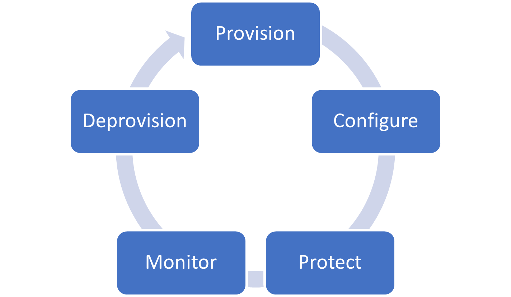

---
# required metadata
title: Cloud PC lifecycle in Windows 365
titleSuffix:
description: Learn about the lifecycle of Cloud PCs in Windows 365.
keywords:
author: ErikjeMS  
ms.author: erikje
manager: dougeby
ms.date: 05/09/2023
ms.topic: overview
ms.service: windows-365
ms.subservice:
ms.localizationpriority: high
ms.technology:
ms.assetid: 

# optional metadata

#ROBOTS:
#audience:

ms.reviewer: saudm
ms.suite: ems
search.appverid: MET150
#ms.tgt_pltfrm:
ms.custom: intune-azure; get-started
ms.collection:
- M365-identity-device-management
- tier2
---

# Cloud PC lifecycle

Windows 365 coordinates and manages the lifecycles of all your Cloud PCs. Because Cloud PCs exist only in the cloud, managing Cloud PC lifecycles is easier than [managing physical Windows device lifecycles](/mem/intune/fundamentals/device-lifecycle). Cloud PCs never leave the manageability and security inherently provided by the cloud.

The Cloud PC lifecycle has five stages:

## Provision

Windows 365 gives you an optimized experience for deploying your Cloud PCs. The admin experience for setting up your deployment is integrated into the [Microsoft Intune admin center](https://go.microsoft.com/fwlink/?linkid=2109431). Cloud PCs are [provisioned](provisioning.md) in the Windows 365 service, connected to Azure, joined to your Azure AD, and enrolled into Microsoft Intune.

By assigning a Windows 365 license to a user and adding them to a group targeted with a [provisioning policy](provisioning.md), you trigger automatic provisioning of the user’s Cloud PC.

Each Cloud PC is created using an operating system [image](device-images.md). Windows 365 includes a gallery of default [images](device-images.md) that provide a remote connection experience optimized for both Windows and Microsoft 365. You can also upload your own custom images and Windows 365 will perform some of the optimizations for you.

Windows 365 also has monitoring infrastructure and synthetic provisioning tests built into [Azure network connections](azure-network-connections.md). These tests run regularly to test your networking and other prerequisites. These tests help minimize provisioning failures due to environmental issues and helps you resolve those issues quicker.

## Configure

Cloud PCs need to be configured and secured, just like any other endpoint in your environment. To make this configuration seamless, as part of provisioning, every Windows 365 Cloud PC is either:

- [Azure AD joined](/azure/active-directory/devices/concept-azure-ad-join) or
- [Hybrid Azure AD joined](/azure/active-directory/devices/concept-azure-ad-join-hybrid).

 After being joined, Cloud PCs are enrolled into Microsoft Intune. This enrollment means that every Cloud PC is instantly ready for [Azure AD Conditional Access](/azure/active-directory/conditional-access/overview) and management through Microsoft Intune, including [co-management](/mem/configmgr/comanage/overview) if needed.

Microsoft Intune helps you to validate that your Cloud PCs are compliant by using [compliance policies](/mem/intune/protect/device-compliance-get-started). Windows 365 also provides an optimized [security baseline](/mem/intune/protect/security-baselines) for Cloud PCs. This optional baseline helps you make sure that your Cloud PCs are securely configured with minimal overhead. These baselines have been optimized to ensure that remote connectivity isn't impacted.

## Protect

Windows 365 integrates with the rest of Microsoft 365 to make sure that you can secure your Cloud PCs. You can use Microsoft Intune’s [integration with Microsoft Defender for Endpoint](/mem/intune/protect/advanced-threat-protection) to protect your Cloud PCs from the moment that they’re provisioned. This protection includes using the endpoint detection and response capabilities of Microsoft Defender for Endpoint to [determine device risk](/mem/intune/protect/advanced-threat-protection-configure#create-and-assign-compliance-policy-to-set-device-risk-level).

Windows 365 can also be protected by [Azure AD Conditional Access](/azure/active-directory/conditional-access/overview). This protection includes optionally excluding Windows 365 itself from device compliance policies to ensure that your end users can access their Cloud PCs from any device. You can still use multi-factor authentication, sign-in risk, and other controls to ensure that the user is securely authenticated.

Windows 365 uses the Windows Update auto-scan ability to install the latest quality updates. To make sure that updates are installed promptly, the end user should sign in to the newly provisioned Cloud PC as soon as possible.

You can also disable clipboard and drive redirection to ensure a foundation of data loss prevention. Disabling prevents users from:

- Copy/pasting information from their Cloud PCs to other unmanaged locations.
- Saving files to their personal devices from Cloud PCs.

## Monitor

A key requirement of Cloud PCs is making sure that the virtual hardware is the right size for the needs of the end user. Windows 365 integrates with the [Endpoint analytics](/mem/analytics/overview) in [Microsoft Productivity Score](/microsoft-365/admin/productivity/productivity-score). Endpoint analytics provide measurement of the compute and memory load on your Cloud PCs. You can then use Windows 365 to [resize](resize-cloud-pc.md) those Cloud PCs to match the demands of your users and their apps. This resize action is surfaced in Microsoft Intune along with other device actions to provide a seamless experience between your Cloud PCs and other endpoints.

You can also use [Remediation](/mem/analytics/remediations) in Endpoint analytics to improve Cloud PC monitoring and remediation. Remediation lets you extend the built-in Microsoft 365 optimizations that Windows 365 provides, including optimizations for a heterogenous IT environment.

## Deprovision

There are a couple ways to securely remove a user’s access to their Cloud PC. If you remove the user’s license or targeted provisioning policy, their Cloud PC is moved into a seven-day grace period. This grace period allows for errors and reinstatement without affecting the user. To block access immediately, disable the user account in on-premises Active Directory and revoke the user’s refresh tokens in Microsoft Azure Active Directory.

After the grace period expires, Windows 365 deprovisions the Cloud PC and its storage completely. The Cloud PCs are encrypted using [server-side encryption in Azure Disk Storage](/azure/virtual-machines/disk-encryption) (platform-managed keys) so that devices are deprovisioned securely.

<!-- ########################## -->
## Next steps

[Learn about the provisioning process](provisioning.md).
