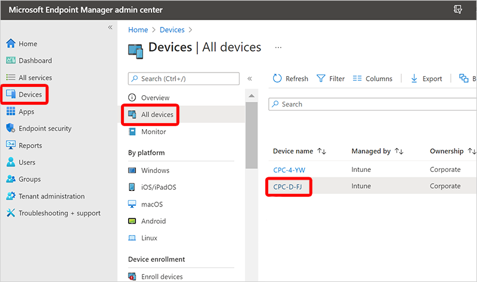
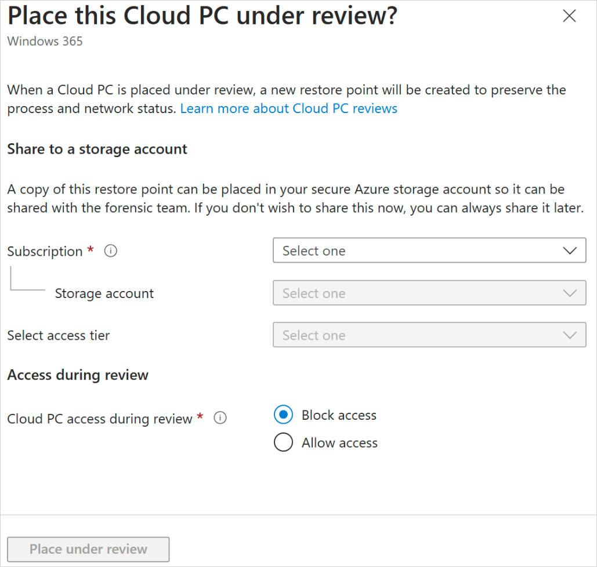

---
# required metadata
title: Place a Cloud PC under review
titleSuffix:
description: Learn how placing a Windows 365 Cloud PC can help you support digital forensics.
keywords:
author: ErikjeMS  
ms.author: erikje
manager: dougeby
ms.date: 01/30/2025
ms.topic: overview
ms.service: windows-365
ms.subservice: windows-365-enterprise
ms.localizationpriority: high
ms.assetid: 

# optional metadata

#ROBOTS:
#audience:

ms.reviewer: anbiswas    
ms.suite: ems
search.appverid: MET150
#ms.tgt_pltfrm:
ms.custom: intune-azure; get-started
ms.collection:
- M365-identity-device-management
- tier2
---

# Place a Windows 365 Enterprise Cloud PC under review

As part of a digital forensics request, you may be asked to provide a snapshot of a Cloud PC to internal or external investigators. Placing a Cloud PC under review saves a snapshot of the Cloud PC to your Azure Storage account. From there, you can provide the snapshot to the investigator.

> [!NOTE]
> Up to 10 Cloud PCs can be placed under review simultaneously. When more than 10 are placed under review at once, the requests are queued up for processing, but the possibility of timeouts increases if the requests remain too long in the queue. If you experience timeouts, it is recommended you stagger the requests to allow sufficient time for previous requests to complete first.   

## Requirements

To place a Cloud PC under review, you must meet the following requirements:

- A Windows 365 Enterprise license.
- An Azure Storage account in the same tenant, set up as per the requirements below.

## Set up your Azure storage account

To place a Cloud PC under review, you must first have an Azure storage account in the same tenant as the Cloud PC. For more information to help you decide which type of account fits your needs, see [Storage account overview](/azure/storage/common/storage-account-overview). We recommend that you create and maintain a dedicated storage account with dedicated access controls for auditing Cloud PCs.
As part of the process to place Cloud PCs under review, Windows 365 requires the **Storage Account Contributor** and **Storage Blob Data Contributor** roles for your Azure storage account.

1. [Create a Storage Account](/azure/storage/common/storage-account-create) in the Azure subscription of your choice. To create the account, you can use PowerShell, Azure CLI, Azure Resource Manager Template, or Azure portal.
2. Configure the storage account with the following settings;
    - **Instance details**
        - **Region**: Same region as CloudPC suggested for performance. There is no restriction on which region.
        - **Performance**: **Premium** (supports hot access tier) or **Standard** (supports all [access tiers](/azure/storage/blobs/access-tiers-overview)).
        - **Premium account type**: **Page blobs**
    - **Security**
        - Minimum TLS version: **Version 1.2**.
        - Confirm **Allow blob anonymous access** is disabled (the default).
        - Disable **Enable storage account key access**.
    - **Networking**
        - **Network access**: **Enable public access from all networks**

    OPTIONAL: If you want to copy your storage account copied to immutable storage, set these fields:

      - Select **Enable versioning for blobs**.
      - Select **Enable version-level immutability support**.
      - When the **Premium** **Performance** option is selected, **Zone-redundant storage (ZRS)** must also be selected. Locally-redundant storage (LRS) is not a supported immutable storage option.

    NOT SUPPORTED: Setting a [Permit scope for copy operations](/azure/storage/common/security-restrict-copy-operations). It must be (null), the default value, to allow copying from any storage account to the destination account.

3. [Assign an Azure role for access to blob data](/azure/storage/blobs/assign-azure-role-data-access). The minimum permissions required for the Windows 365 service to place a Cloud PC under review are Storage Account Contributor and Storage Blob Data Contributor.

## Place a Cloud PC under review

After setting up an Azure storage account with permissions as explained above, you can place a Cloud PC under review using the following steps:

1. Sign in to the [Microsoft Intune admin center](https://go.microsoft.com/fwlink/?linkid=2109431) and select  **Devices** > **All Devices** > choose a device.
    

2. Select the ellipses (**…**) > **Place cloud PC under review**.
    :::image type="content" source="./media/place-cloud-pc-under-review/place-cloud-pc-under-review.png" alt-text="[Screenshot of place a Cloud PC under review." lightbox="./media/place-cloud-pc-under-review/place-cloud-pc-under-review.png":::

3. Select the **Subscription**, **Storage account**, and **[Access tier](/azure/storage/blobs/access-tiers-overview)** (hot costs the most while archive costs the least) to which the Windows 365 service was given **Storage Account Contributor** and **Storage Blob Data Contributor** permissions.

    Only Hot tier page blobs can be mounted by a VM. All other tiers are block blobs, which must be converted to a page blob if you need to mount the disk on a VM. The archive tier is an offline tier, so rehydration to an online tier is necessary before converting to a page blob.

    **Standard performance storage account tiers**: For a Standard performance storage account, the tier for the blob being copied from Windows 365 to your storage account can be a different tier. If you setup a hot tier storage account, other objects will be hot by default. However, you can set the Cloud PC under review image to be cool, cold or archive.

    **Premium performance storage account tiers**: Premium performance is always a hot tier storage account. The drop-down menu for access tier is ignored for Premium performance storage accounts.

4. Under **Access during review**, if you choose

   - **Block Access**, the Cloud PC will be immediately powered off so the user cannot access the Cloud PC, and then the snapshot will be created. This is useful in cases where you may want to contain a security threat by shutting the Cloud PC down, and then performing analysis of the snapshot later in an isolated environment.
   - **Allow Access**, the Cloud PC user can continue to use the Cloud PC even as you create a snapshot in the storage account.

    

5. Select **Place under review**. Based on the disk size of the Cloud PC and storage account destination region, it can range from minutes to a few hours for each snapshot to be saved to the storage account. For example, it can take up to one hour or more per 128 GB of disk data for a storage account in the same Azure region.

To make the snapshot tamper-evident, you should create a file hash of the snapshot when it has been saved in the storage account. One way of creating the file hash is to use the [Get-FileHash](/powershell/module/microsoft.powershell.utility/get-filehash) cmdlet. For best performance, the Get-FileHash cmdlet should be run against a copy of the downloaded file or be run against the snapshot in the Azure storage account from a resource located in the same Azure region.

## Remove a Cloud PC from review

Sign in to the [Microsoft Intune admin center](https://go.microsoft.com/fwlink/?linkid=2109431) and select  **Devices** > **All Devices** > choose a device > **…** > **Remove from review**.

## Bulk actions

You can also use Intune’s bulk device actions to place multiple Cloud PCs under review at the same time. For more information, see [Use bulk device actions]( /mem/intune/remote-actions/bulk-device-actions).

> [!NOTE]
> Up to 10 Cloud PCs can be placed under review simultaneously. When more than 10 are placed under review at once, requests are queued and timeouts may increase if the request remains in the queue for too long. If you experience timeouts, it is recommended you stagger the requests to allow sufficient time for previous requests to complete first. Completion times will depend on the size of the Cloud PC disk as well as the location and type of your Azure Storage account.   

## Management with API

You can use the Graph API to place or remove a Cloud PC from review. For more information, see [managedDevice: setCloudPcReviewStatus](/graph/api/manageddevice-setcloudpcreviewstatus?view=graph-rest-beta&tabs=http).

## Next steps
[Learn more about digital forensics and Cloud PCs](digital-forensics.md).
