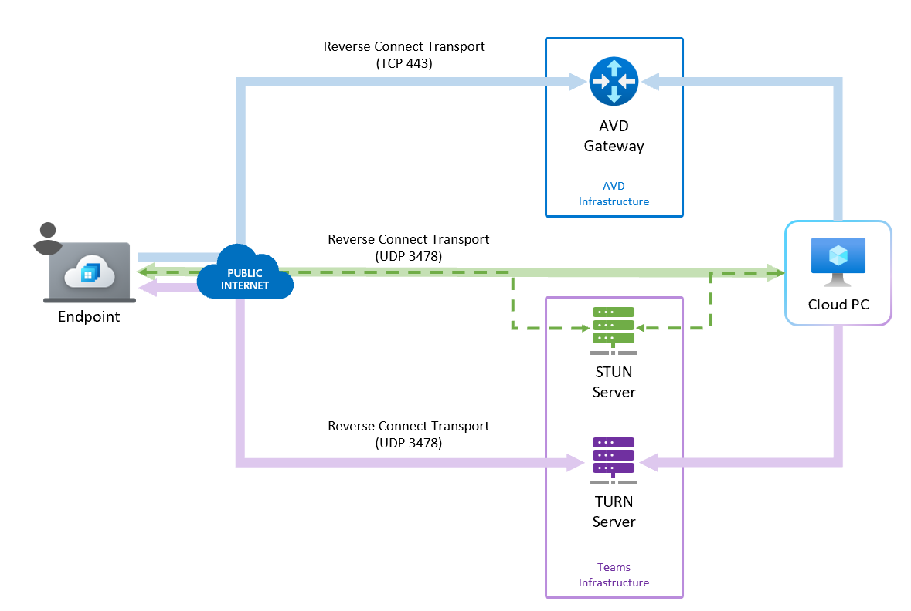

---
# required metadata
title: Use RDP Shortpath for public networks with Windows 365 Cloud PCs.
titleSuffix:
description: Learn how to use RDP Shortpath for public networks with Windows 365 Cloud PCs.
keywords:
author: ErikjeMS  
ms.author: erikje
manager: dougeby
ms.date: 06/15/2023
ms.topic: how-to
ms.service: windows-365
ms.subservice:
ms.localizationpriority: high
ms.technology:
ms.assetid: 

# optional metadata

#ROBOTS:
#audience:

ms.reviewer: docoombs
ms.suite: ems
search.appverid: MET150
#ms.tgt_pltfrm:
ms.custom: intune-azure; get-started
ms.collection:
- M365-identity-device-management
- tier2
---

# Use RDP Shortpath for public networks with Windows 365  

You can now use Remote Desktop Protocol (RDP) Shortpath for public networks with your Windows 365 Cloud PCs. RDP Shortpath for public networks can provide another connection path for improved Cloud PC connectivity, especially in suboptimal network conditions.

## Requirements

To use RDP Shortpath for public networks with Windows 365, you must meet these requirements:

- Session Host (Cloud PC)
  - UDP outbound to all public IP space (because, in most cases, it’s not possible to know the source IP address of the connecting PC).
  - STUN server IP ranges on UDP port 3478.
- Client PC Network  
  - UDP outbound:  
    - To the public IP addresses assigned to NAT gateway or the Azure Firewall in an Azure Hosted Network Scenario.
    - For a Microsoft Hosted network scenario, all public IP spaces.

## Enable RDP Shortpath for public networks

To enable RDP Shortpath for public networks, visit the following Azure Virtual Desktop documentation page and follow the instructions:

[Enable RDP Shortpath for public networks](/azure/virtual-desktop/rdp-shortpath?tabs=public-networks).

## Verify UDP connectivity

UDP connectivity can be checked within the “Connection Information” section of a Remote session. For more information, see [Verify RDP Shortpath is working](/azure/virtual-desktop/configure-rdp-shortpath?tabs=public-networks#verify-rdp-shortpath-is-working).

## RDP Shortpath benefits

The default connectivity to a Windows 365 Cloud PC is through a TCP connection that traverses a gateway using the [reverse connect](/azure/virtual-desktop/network-connectivity) transport. The reverse transport means that there’s no need for inbound connectivity to the session host (Cloud PC) to connect RDP traffic.

RDP Shortpath builds on the TCP connection and provides, when possible, another direct connection between the Remote Desktop client and the Windows 365 Cloud PC. This connection uses UDP as the underlying  transport protocol. The direct path and protocol deliver improved connection reliability, lower latency, and higher available bandwidth.

For more information about RDP Shortpath benefits, see [Key benefits](/azure/virtual-desktop/rdp-shortpath?tabs=public-networks#key-benefits).

## RDP Shortpath connection process

When you use RDP Shortpath, the connection with the Cloud PC proceeds as follows:

1. The RDP connection establishes a TCP-based connection using the reverse connect transport through the Gateway (in the same way as it does for connectivity without RDP Shortpath).
2. If RDP Shortpath is enabled on the session host (Cloud PC), the service creates a UDP socket on all viable network interfaces.
3. To test connectivity, the service attempts to connect to a Windows 365 STUN server on the public internet through UDP port 3478. This step also establishes the external IP address of the NAT router.
4. The session host’s candidate table lists the public IP and listener port that it has reachable connectivity on. This information is provided to the connecting client through the established TCP session.
5. The client sends its list of reachable public IP addresses/ports to the session host.
6. Both parties attempt a connection at the same time. Because both are creating outbound connections, it often allows connectivity to be established through firewalls because no inbound initiated connectivity occurs.
7. If connectivity is successful, the service evaluates if the connection is the fastest path. If it is, all dynamic virtual channels (such as graphics, input, device redirection, and more) switch to the new transport flow.

## Known issues

The RDP Shortpath for public networks may not work with Cloud PCs in the following scenarios:

- Where double NAT is in place. For example, if the traffic is routed through a Secure Web Gateway (SWG) or proxy where the connection is Natted twice (first, on egress from Azure and, second, from the VPN/SWG endpoint.)
- Where the connection is routed through an internet proxy or other inspection device.
- Any network that restricts UDP access or limits access to specific ports or IP ranges.
- Where Carrier Grade NAT (CGN) is used. Where the network shares a public IP address with other networks.

For more technical details on these scenarios, see [How RDP Shortpath works](/azure/virtual-desktop/rdp-shortpath?tabs=public-networks#how-rdp-shortpath-works).

## Next steps

For complete information, see [Azure Virtual Desktop RDP Shortpath for public networks](/azure/virtual-desktop/rdp-shortpath?tabs=public-networks).
