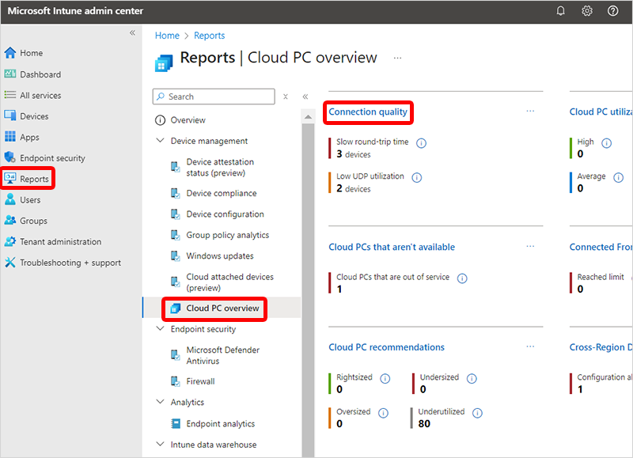

---
# required metadata
title: Cloud PC connection quality report for Windows 365
titleSuffix:
description: Learn about the Cloud PC connection quality report for Windows 365 Cloud PCs.
keywords:
author: ErikjeMS  
ms.author: erikje
manager: dougeby
ms.date: 10/18/2024
ms.topic: overview
ms.service: windows-365
ms.subservice: windows-365-enterprise
ms.localizationpriority: high
ms.assetid: 

# optional metadata

#ROBOTS:
#audience:

ms.reviewer: mattsha
ms.suite: ems
search.appverid: MET150
#ms.tgt_pltfrm:
ms.custom: intune-azure;
ms.collection:
- M365-identity-device-management
- tier2
---

# Cloud PC connection quality report

The **Connection quality report** helps Windows 365 administrators identify devices that might be performing below expectations. Connection quality is a subjective concept with many variables defining what is acceptable in any given circumstance. Admins should use the objective data provided by this report, feed it into their own subjective performance criteria, to determine their organization's policies and remediations.

## Use the Cloud PC connection quality report

To get to the **Cloud PC connection quality** report, sign in to [Microsoft Intune admin center](https://go.microsoft.com/fwlink/?linkid=2109431), select **Reports** > **Cloud PC overview** > **Connection qulaity**.

The device list shows the individual Cloud PCs with the following columns:

- **Device name**
- **Round Trip Time for the most recent (or current) connection** (RTT): The number of milliseconds it takes, at the transport layer only, for communication between the client and the Cloud PC. Lower values indicate better round-trip connectivity.
- **Round Trip Time for the specified date range (P50)**
- **Available bandwidth for the most recent (or current) connection**
- **Available bandwidth for the specified date range (P50)**: network bandwidth observed during sessions with the specified CPC sample set.
- **Connection gateway**
- **Remoting sign-in time (P50)**: The number of seconds it took the user to complete the sign-in process.
- **Client IP address**
- **Protocol for most recent (or current) connection**
- **UDP Utilization average over date range**

Each row in the report gives links to the specific Cloud PC where you can find greater detail regarding the devices connection history and related performance.

You can use the **Columns** and **Add filter** options to customize the report:

- Choose which columns are displayed.
- Filter the range for each column.
- Choose the date range (7 days or 28 days).

You can use these filters to identify connections that don't meet your organization's requirements. Then, you can evaluate potential causes, like:

- Network, host, or client configurations that limit protocol choice.
- Geographic distance.
- Authentication methods and architecture.
- Appropriateness of the client or host.

<!-- ########################## -->
## Next steps

[Remoting connection report](report-remoting-connection.md)
