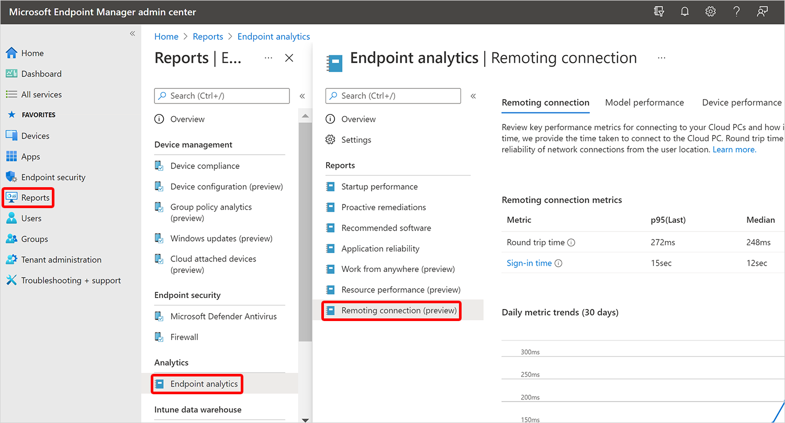
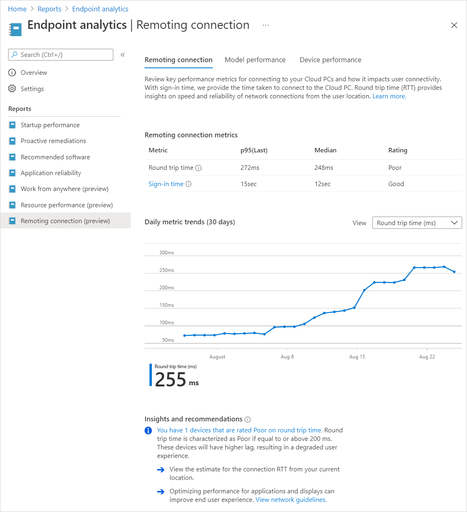
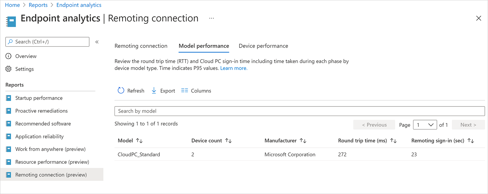
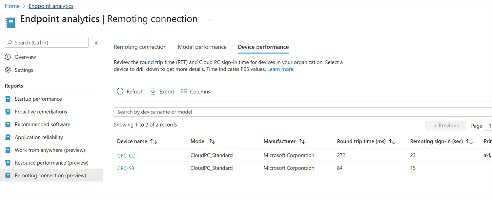
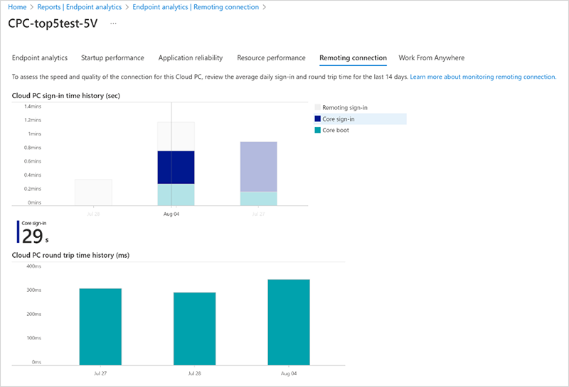

---
# required metadata
title: Remoting connection report for Windows 365
titleSuffix:
description: Learn about the Remoting connection report in Endpoint analytics for Windows 365 Cloud PCs.
keywords:
author: ErikjeMS  
ms.author: erikje
manager: dougeby
ms.date: 06/19/2023
ms.topic: overview
ms.service: windows-365
ms.subservice:
ms.localizationpriority: high
ms.technology:
ms.assetid: 

# optional metadata

#ROBOTS:
#audience:

ms.reviewer: nandis
ms.suite: ems
search.appverid: MET150
#ms.tgt_pltfrm:
ms.custom: intune-azure;
ms.collection:
- M365-identity-device-management
- tier2
---

# Remoting connection report

The Remoting connection report in [Endpoint analytics](/mem/analytics/overview) helps you monitor key performance metrics for connecting to the Cloud PCs. There are two metrics in this report:

- **Round trip time (ms)**
- **Sign in time (sec)**

Resource performance score also contributes to your organization's [Microsoft Productivity score](/microsoft-365/admin/productivity/productivity-score).

## Prerequisites

Before you can use this report, you'll need to [enroll your Cloud PC devices in Endpoint analytics](/mem/analytics/enroll-intune).

## Use the Remoting connection report

To get to the **Remoting connection** report, sign in to [Microsoft Intune admin center](https://go.microsoft.com/fwlink/?linkid=2109431), select **Reports** > **Endpoint analytics** > **Remoting connection**.

## Remoting connection tab

The **Remoting connection** tab lists the following information:

**Round Trip Time (ms)** is the time taken for traffic from users' devices to reach Cloud PC and return. This metric is an indicator of the quality of the connection and can be used to determine the user’s experience. Values displayed are the median time and 95th percentile value of the most recent reading of the metric (p95 Last). A rating is provided for these values based on the criteria below.

- Good = 0-100 milliseconds
- Average = 100-200 milliseconds
- Poor = more than 200 milliseconds

**Sign in time (sec)** is the total time taken for users to connect to the Cloud PC. Values displayed are the median time and 95th percentile value of the most recent reading of the metric (p95 Last). A rating is provided for these values based on the criteria below.

- Good = 0-30 seconds
- Average = 30-60 seconds
- Poor = more than 60 seconds

**Core boot**: Average time it takes to reach the sign-in prompt after a device is turned on. Excludes operating system update time.

**Core sign-in**: Average time it takes to get to a responsive desktop after a user signs in. Excludes new user sign-in and first sign-in after a feature update.

**Insights and recommendations** provide information about the actions that you can take to improve scores for specific Cloud PCs that have poor or average ratings.

## Model performance tab

You can review the **Round trip time** and **Sign in time** for each Cloud PC model SKU in your organization.

## Device performance tab

You can review a list of the **Round trip time** and **Sign in time** values for all the Cloud PC devices in your organization.

## Device history

Select a device in one of the reports to see a daily aggregate bar chart for that device over the last 14 days. Days that have no values are excluded from the chart. Hover over individual days to see values at the bottom of the chart.

> [!NOTE]
> There may be days when users have signed in but the graph does not display a value. This is caused by the method the graph uses to calculate some edge cases than can result in incorrect data.

<!-- ########################## -->
## Next steps

[Resource performance report](report-resource-performance.md)
