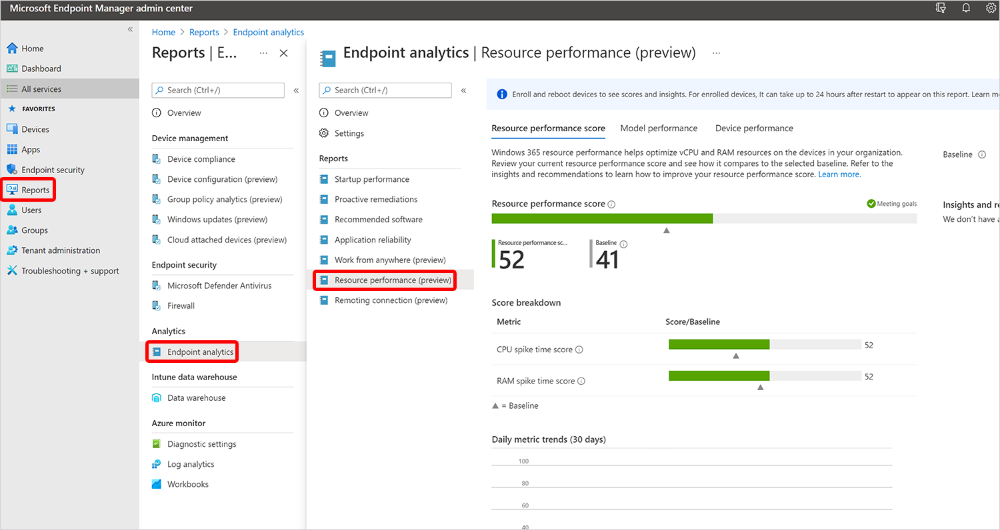
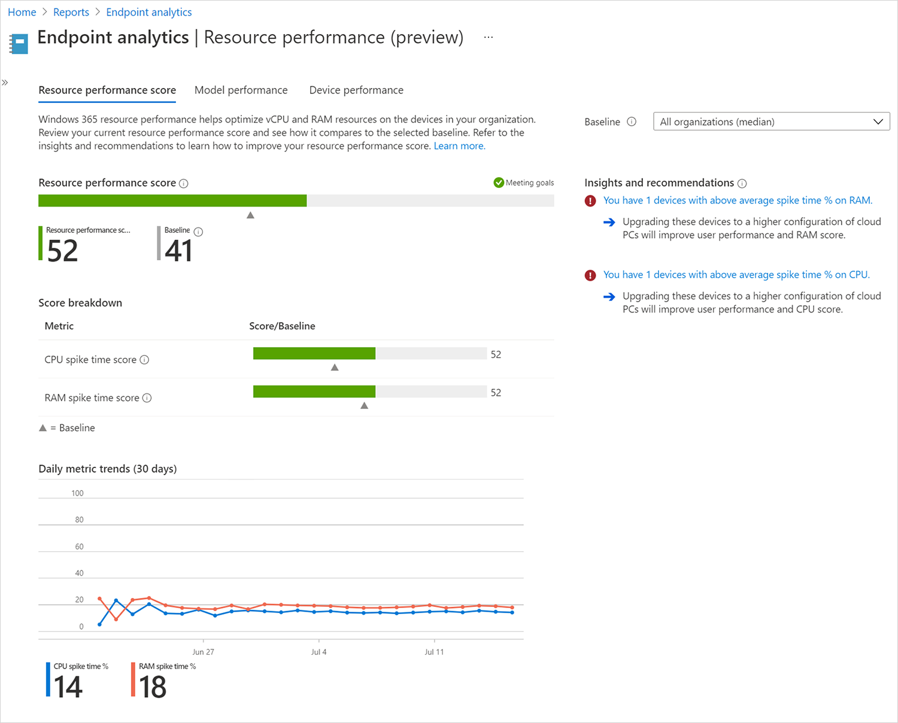
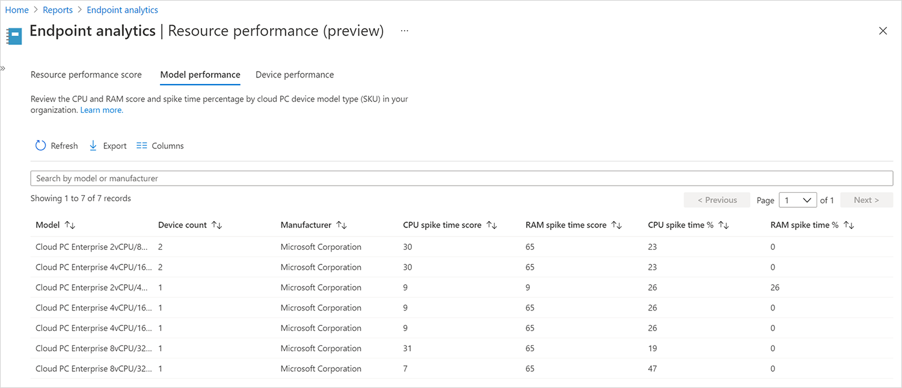
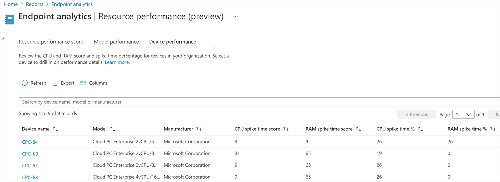
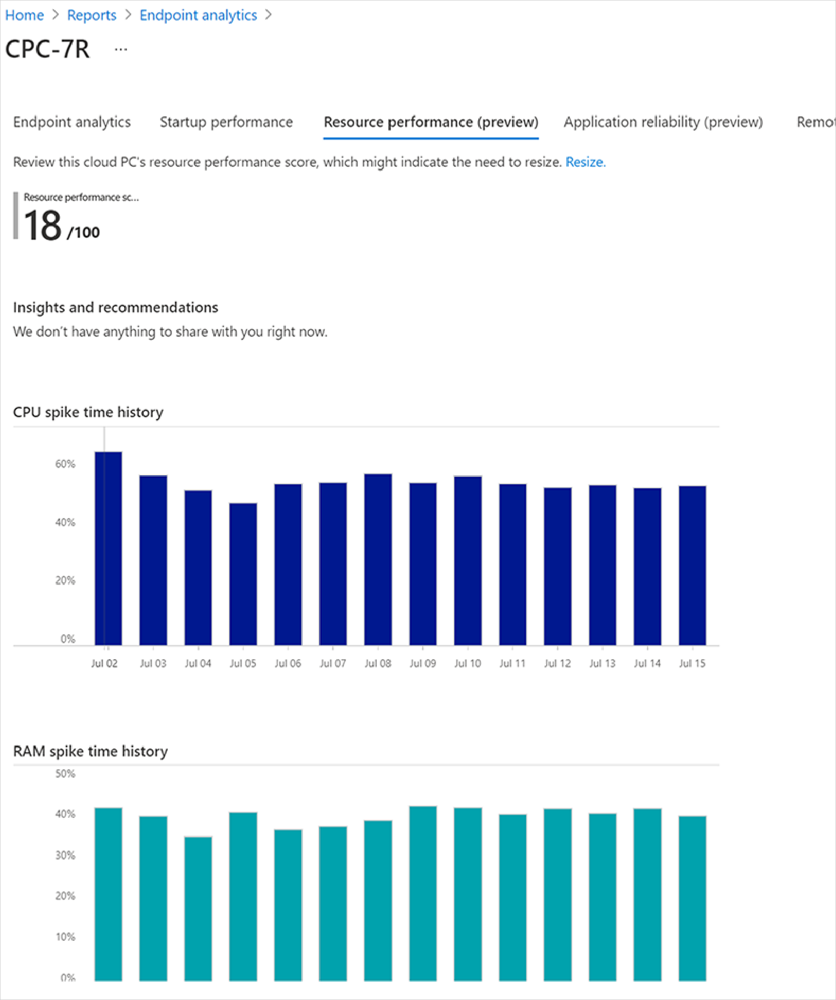

---
# required metadata
title: Resource performance report for Windows 365
titleSuffix:
description: Learn about the Resource performance report in Endpoint analytics for Windows 365 Cloud PCs.
keywords:
author: ErikjeMS  
ms.author: erikje
manager: dougeby
ms.date: 08/16/2022
ms.topic: overview
ms.service: windows-365
ms.subservice:
ms.localizationpriority: high
ms.technology:
ms.assetid: 

# optional metadata

#ROBOTS:
#audience:

ms.reviewer: nandis
ms.suite: ems
search.appverid: MET150
#ms.tgt_pltfrm:
ms.custom: intune-azure;
ms.collection: M365-identity-device-management
---

# Resource performance report

The Resource performance report in [Endpoint analytics](/mem/analytics/overview) helps you optimize vCPU and RAM resources on the Cloud PC devices in your organization. The report includes four tabs of information:

- **Resource performance score**
- **Model performance**
- **Device performance**
- **Device history**

Resource performance score also contributes to your organization's [Microsoft Productivity score](/microsoft-365/admin/productivity/productivity-score).

## Prerequisites

Before you can use this report, you'll need to [enroll your Cloud PC devices in Endpoint analytics](/mem/analytics/enroll-intune).

## Use the Resource performance report

To get to the **Resource performance** report, sign in to [Microsoft Endpoint Manager admin center](https://go.microsoft.com/fwlink/?linkid=2109431), select **Reports** > **Endpoint analytics** > **Resource performance**.

## Resource performance score tab

The **Resource performance score** is an overall performance rating (from 0 to 100) for all the Cloud PCs that you manage. This score is a weighted average of **CPU spike time score** and **RAM Spike time score**.

- **CPU spike time %**: The daily metric trends graph plots the ratio of CPU spike times to total usage time. This CPU spike % data is averaged over a 14-day period ending on the date at the bottom of the graph. Usage over 50% is considered a spike.
- **RAM Spike time %**: The daily metric trends graph plots the ratio of RAM spike times to total usage time. This RAM spike % data is averaged over a 14-day period ending on the date at the bottom of the graph. Usage over 50% is considered a spike.

**Baseline** helps you see if you're meeting goals. You can set the baseline to the organizational median or a custom value.

**Insights and recommendations** suggests actions that you can take to improve your scores.

## Model performance tab

You can review the CPU spike time and RAM spike time scores and percentages by for each Cloud PC model SKU in your organization.

## Device performance tab

You can review the CPU spike time and RAM spike time scores and percentages by for each Cloud PC device in your organization.

## Device history

When you select a particular device in one of the reports, you'll see specific information for that device. If device score is below the baseline, you can improve device performance and score by adding more resources to the device and taking a resize action.

<!-- ########################## -->
## Next steps

[Remoting connection report](report-remoting-connection.md)
