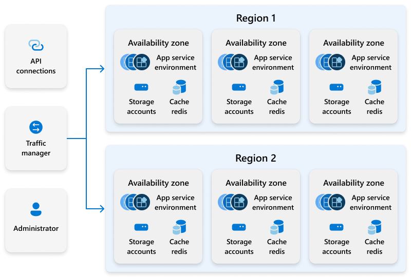

---
# required metadata
title: Windows 365 service architecture and resilience
titleSuffix:
description: Learn about Windows 365 service resilience.
keywords:
author: ErikjeMS 
ms.author: erikje
manager: dougeby 
ms.date: 08/06/2024
ms.topic: conceptual
ms.service: windows-365
ms.subservice:
ms.localizationpriority: high
ms.assetid: 

# optional metadata

#ROBOTS:
#audience:

ms.reviewer: thhickli
ms.suite: ems
search.appverid: MET150
#ms.tgt_pltfrm:
ms.custom: 
ms.collection:
- M365-identity-device-management
- tier2
---

# Windows 365 service resilience

Windows 365 is designed to provide a resilient and reliable service for organizations and end users, connecting to, and using their Cloud PCs. 

Windows 365 uses the [Azure Virtual Desktop service](/azure/virtual-desktop/service-architecture-resilience) to connect and broker end user connections to their Cloud PC in any of the supported Azure regions from anywhere, on any device. To minimize outages and support end user and administrator requests, resilience is architected into these services. In addition to this, Windows 365 operates another set of platform infrastructure that provides the many administrator and end user features that manage and control the overall Windows 365 experience. Microsoft fully manages this infrastructure.

Example architecture of a Windows 365 service that enables administrators or end user operations:

Windows 365 is a software-as-a-service (SaaS) service, where customers of the service don't have to architect, deploy, or manage complex infrastructure. As a SaaS service, Microsoft manages the underlying infrastructure for all of the individual Windows 365 services. This management maintains a global, fully available, resilient service that customers can rely upon for the daily use of their Cloud PCs. Microsoft continually works to improve the architecture of the service to improve the resilience and recovery times should there be an outage in any of the related Azure services. However, as a SaaS service, Windows 365 requires shared responsibility in overall service delivery to end users. Windows 365 aligns to the [Microsoft 365 guidance and recommendations for business continuity and cloud partner responsibilities](/compliance/assurance/assurance-customer-and-cloud-partner-ebcm-responsibilities)

In addition to the Azure Virtual Desktop connectivity layer, Windows 365 operates many dedicated services that are architected as microservices to support agile operations and independence. Each of these services performs specific tasks related to administrator or end user requests. Some examples include:

- The Windows 365 provisioning service processes deployment requests to provision Cloud PCs according to the specifications and locations defined by the administrator making the request.
- The Entra ID notification service monitors administrator changes to Microsoft Entra ID groups, subscriptions, and licenses that trigger new deployments.
- Other services manage:
  - The administrator portal.
  - The end user portal.
  - Disaster recovery.
  - Diagnostics.
  - Troubleshooting.
  - Service monitoring.
  - And all other functions of Windows 365.  

Each of these services:

- Is its own web service that uses standard Azure infrastructure services. Each service has a certain set of extra Azure infrastructure requirements like CosmosDB, Azure storage, and Event hubs.
- Is architected for resiliency. For example, for the services storage requirements an Azure Storage accounts with Globally Redundant Storage (GRS) is used. For database services such as CosmosDB, the data store is replicated across regions.
- Is architected to use Azure resilience services like Azure availability zones, and cross region failover.

The following diagram shows the architecture of an example service. Windows 365 distributes its infrastructure across multiple availability zones within a region and across multiple Azure regions. The service operates in an active-active manner. This supports in-region and cross-region resiliency. If an outage occurs within a region, the service continues functioning. If a region fails, the service is transferred to the secondary region's infrastructure, and normal operations continue.

## Virtual machine resiliency

Each Windows 365 Cloud PC is a single instance Azure virtual machine. Resilience is provided at the Azure host level to mitigate any compute continuity issues. For more information, see [Business continuity and disaster recovery overview](business-continuity-disaster-recovery.md).

## Customer best practices

As Windows 365 has a shared responsibility for overall service delivery, there are some best practices that customers should follow to increase the resiliency of the overall service.

**[Microsoft hosted network](deployment-options.md#microsoft-hosted-network)**. Use a Microsoft hosted network when creating a provisioning policy. Microsoft hosted network is a Microsoft managed networking option, where no Azure vNet or subscription is required for Cloud PC network connectivity. This option lets Microsoft make the placement decisions for the Cloud PC virtual machines and decreases the possibility of provisioning issues.

**[Azure Network Connection](/azure/architecture/guide/virtual-desktop/windows-365-azure-network-connection)**. If you need granular control of your corporate network traffic – firewall rules, custom routes, or on-premises network access – the Azure Network Connection (ANC) feature lets you bring your own Azure vNet/subscription to Windows 365. For customers using the ANC, create multiple connections and prioritize these connections in order of failover usage. This prioritization provides a network connection failover if there's a networking outage.

**[Point-in-time restore](restore-overview.md)**. This service allows you to fully restore your Cloud PC to a previous state. You can configure the service to automatically create restore points across short and longer time windows.

**[Cross region disaster recovery](cross-region-disaster-recovery.md)**. This Windows 365 add-on feature that creates snapshots of Cloud PCs. These snapshots are placed in customer-defined, geographically distant locations. The snapshots can be recovered to Cloud PCs running in the selected location during a disaster recovery event.

## Next steps

[Windows 365 architecture](architecture.md)]
[High-level architecture diagram for Windows 365](high-level-architecture.md)
