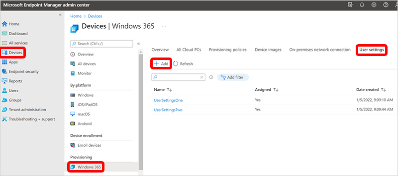
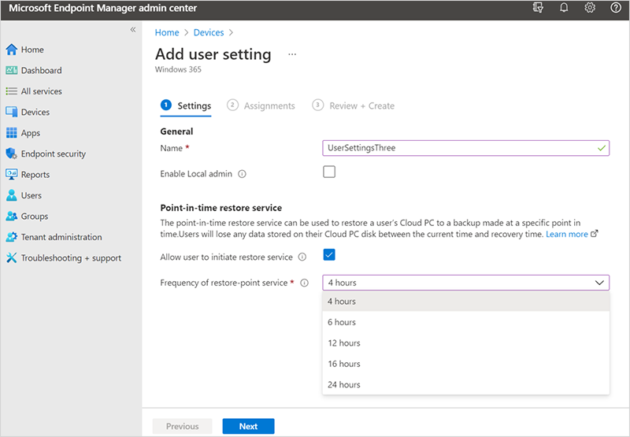

---
# required metadata
title: Configure Windows 365 to permit point-in-time restore of Cloud PCs
titleSuffix:
description: Learn about how to configure Windows 365 to permit restoring Cloud PCs to a previous state.
keywords:
author: ErikjeMS 
ms.author: erikje
manager: dougeby
ms.date: 03/02/2022
ms.topic: conceptual
ms.service: windows-365
ms.subservice:
ms.localizationpriority: high
ms.technology:
ms.assetid: 

# optional metadata

#ROBOTS:
#audience:

ms.reviewer: docoombs
ms.suite: ems
search.appverid: MET150
#ms.tgt_pltfrm:
ms.custom: 
ms.collection:
- M365-identity-device-management
- tier2
---

# Configure point-in-time restore settings

Point-in-time restore can be configured in a new or existing user setting. All users in groups assigned to the user setting have permission to use the point-in-time restore feature.  You can configure point-in-time restore to let your enterprise users start a restore on their Cloud PC. You can also configure the system to have a different cadence for short-term restore points.

1. Sign in to the [Microsoft Endpoint Manager admin center](https://go.microsoft.com/fwlink/?linkid=2109431) > **Devices** > **Windows 365** > **User Settings** > **Add**. (Alternately, you can edit an existing user setting.)

2. On the **Add user setting** page:
    1. Type a **Name**.
    2. If you want the users for this setting to have local admin rights, select **Enable Local admin**.
    3. If you want end users to have permissions to restore their own Cloud PCs, select **Allow user to initiate restore service**.
    4. For **Frequency of restore-point service**, choose an interval for how often restore points will be created. There's a limit of 10 restore points. So a shorter frequency results in a shorter overall history of restore points.
    5. Select **Next**.

3. On the **Assignments** page, select the groups that you want to have this setting > **Next**.
4. On the **Review + Create** page, confirm your choices > **Finish**.

Users in the groups assigned to this user setting will now be able to use the point-in-time restore feature as described below.

<!-- ########################## -->
## Next steps

- [Restore a single Cloud PC](restore-single-cloud-pc.md)
- [Bulk restore multiple Cloud PCs](restore-bulk.md)
