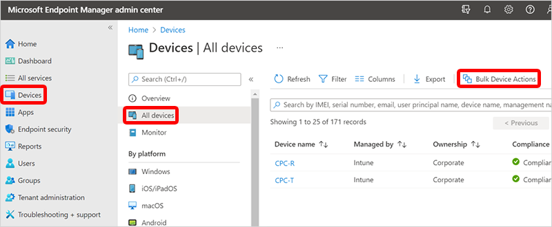

---
# required metadata
title: Share Cloud PC restore points to storage
titleSuffix:
description: Learn how to share Windows 365 Cloud PC restore points to an Azure Storage Account.
keywords:
author: ErikjeMS 
ms.author: erikje
manager: dougeby
ms.date: 03/09/2023
ms.topic: conceptual
ms.service: windows-365
ms.subservice:
ms.localizationpriority: high
ms.technology:
ms.assetid: 

# optional metadata

#ROBOTS:
#audience:

ms.reviewer: docoombs
ms.suite: ems
search.appverid: MET150
#ms.tgt_pltfrm:
ms.custom: 
ms.collection:
- M365-identity-device-management
- tier2
---

# Share Cloud PC restore points to an Azure Storage Account

Cloud PC [restore points](restore-overview.md) can be shared to a storage account both singly and in bulk.

You might want to share (move or copy) a Cloud PC and its contents to:

- Create a geographically distributed copy of a Cloud PC.
- Make a copy of a cloud PC during the off-boarding process.
- Get a historical view of a Cloud PC (vs current) for eDiscovery.
- Create a VHD that can be mounted on a physical device.

## Share a single restore point

1. Sign in to the [Microsoft Intune admin center](https://go.microsoft.com/fwlink/?linkid=2109431) > **Devices** > **All devices** > select a device > select the ellipses (**...**) > **Share**.
1. In the **Select restore point** area, select a **Subscription** and **Storage account**.
1. Select **Share**.

A folder is created in the storage account. The folder name is identical to the Cloud PC name. The folder contains a VHD copy of the Cloud PC device disk.

## Share multiple restore points in bulk

1. Sign in to the [Microsoft Intune admin center](https://go.microsoft.com/fwlink/?linkid=2109431) > **Devices** > **All devices** > **Bulk Device Actions**.

1. On the **Basics** page, select the following options:
    1. **OS**: Windows
    1. **Device action**: Share Cloud PC restore point to storage
    1. **Specify date and time**: Choose a date and time. This setting defines the Cloud PC restore point time that you’d like to share. The following options help determine exactly which restore point is used for each of the Cloud PCs you select.
    1. **Select restore point time range**: Choose one of the following options:
        - **Before specified date and time**: Share the closest Cloud PC restore point before the date and time you specified.
        - **After specified date and time**: Share the closest Cloud PC restore point after the date and time you specified.
        - **Whichever is closest (before or after specified date and time)**: Share the Cloud PC restore point closest to the date and time you specified.
1. Select a **Subscription** and **Storage account** > **Next**.
1. On the **Devices** page, choose **Select devices to include**.
1. In the **Select devices**, choose the Cloud PCs that you want to share restore points for > **Select** > **Next**.
1. On the **Review + create** page, confirm your choices > **Create**.

For each Cloud PC restore point shared, a folder is created in the storage account. The folder name is identical to the Cloud PC name. The folder contains a VHD copy of the Cloud PC device disk.

<!-- ########################## --> 
## Next steps

- [Restore a single Cloud PC](restore-single-cloud-pc.md)
- [Bulk restore multiple Cloud PCs](restore-bulk.md)
