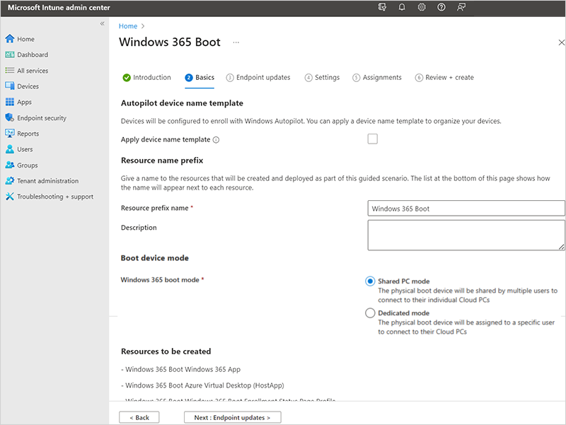
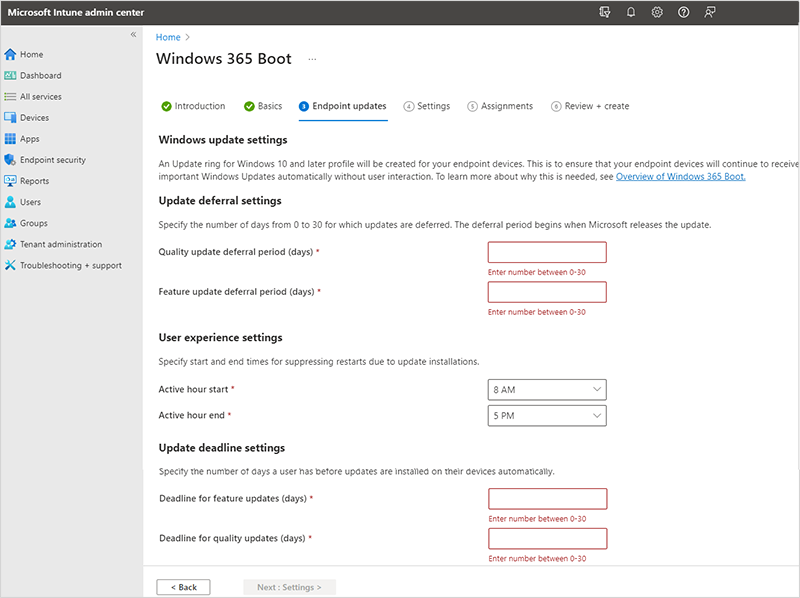

---
# required metadata
title: Windows 365 Boot guided scenario
titleSuffix:
description: Use the Windows 365 Boot guided scenario to prepare physical devices to boot directly to Cloud PCs
keywords:
author: ErikjeMS  
ms.author: erikje
manager: dougeby
ms.date: 01/11/2024
ms.topic: overview
ms.service: windows-365
ms.subservice:
ms.localizationpriority: high
ms.technology:
ms.assetid: 

# optional metadata

#ROBOTS:
#audience:

ms.reviewer: elluthra
ms.suite: ems
search.appverid: MET150
#ms.tgt_pltfrm:
ms.custom: intune-azure; get-started; intro-overview
ms.collection:
- M365-identity-device-management
- tier2
---

# Guided scenario - deploy Windows 365 Boot to shared physical devices

By following this guided scenario, you can deploy [Windows 365 Boot](windows-365-boot-overview.md) to shared Windows 11 Pro physical devices. Windows 365 Boot lets physical device users sign in directly to their Cloud PCs, without signing in to their physical devices.

This guide steps you through defining:

1. Autopilot device name templates and resource name prefixes.
2. Windows update settings.
3. VPN profile, Wifi profile, and language settings.
4. Group assignments to identify which physical devices are set up for Windows 365 Boot.

For more information about guided scenarios in general, see [Intune guided scenarios overview](/en-us/mem/intune/fundamentals/guided-scenarios-overview).

## Prerequisites

- Each physical device and Cloud PC must be running Windows 11 Enterprise or Professional, version 22621.2361 or later.
- You must have the Intune Service Administrator role.

Before adding physical devices to the group, you must ensure that they meet the [Windows 365 Boot requirements](windows-365-boot-physical-device-requirements.md).

You can complete the guided scenario before there are any devices in the group. After devices are added to the group, and have internet access, they'll automatically get updated with the Windows 365 Boot settings defined in the guided scenario.

## Step 1 - Introduction

1. Sign in to the [Microsoft Intune admin center](https://go.microsoft.com/fwlink/?linkid=2109431) as a user with the Intune Service Administrator role.
2. Select **Devices** > **Windows 365** (under **Provisioning**) > **Windows 365 Boot** (under Windows 365 guides).
3. On the **Introduction** page, select **Next: Basics**.

## Step 2 - Basics

Choose how your devices are named when they enroll, and choose the prefix of all the resources created.

1. **Autopilot device name template**: This guided scenario enrolls your devices in Windows Autopilot. When they enroll, you can optionally name your devices using a unique pattern that applies to all devices. Your options:

   - **Apply device name template**: If you don't check this box, then no template or pattern is created when naming your devices. The device gets the OEM name, such as DESKTOP-, followed by some random characters. Select the box to create a unique pattern to name your devices. For example, enter Contoso-%RAND:7% to name all your devices Contoso- followed by seven random characters.

     The names:

     - Must be 15 characters or less.
     - Can include letters (a-z, A-Z), numbers (0-9), and hyphens.
     - Can't be only numbers, and can't include a blank space.
     - Can use the %SERIAL% macro to add a hardware-specific serial number.
     - Can use the %RAND:x% macro to add a random string of characters, where x equals the number of characters to add.

   - **Resource name prefix**: When you deploy this guided scenario, several resources are automatically created. To distinguish the items used in this deployment, add a prefix.

   - **Boot device mode**: Select one of the following options:

      - **Shared PC mode**: For physical devices shared by multiple users.
      - **Dedicated mode** ([preview](../public-preview.md)): For a physical device used by one specific user.

2. **Enter a resource prefix name**: Enter some text to put at the beginning of the items created. For example, enter `Windows 365 Boot`. All resources created are named something like **Windows 365 Boot Azure Virtual Desktop (HostApp)**.

3. Select **Next: Endpoint updates**.

## Step 3 - Endpoint updates

On the **Endpoint updates** page, set the options that you want to use for Windows Updates on the physical devices. Make sure that your choices comply with your organization's security requirements. Select **Next: Settings**.

Windows 365 Boot supports [Windows Autopatch](/windows/deployment/windows-autopatch/overview/windows-autopatch-overview) to automate patch management to Windows 365 Boot physical devices. If you use this automation, it should be configured outside this guided scenario.  

## Step 4 - Settings

1. (Optional) On the **Settings** page, select the **VPN profile** and **Wifi profile** to use for Windows 365 Boot physical devices.
2. (Optional) If you don't want to use the operating system's default language, select a specific **Language (region)** > **Next: Assignments**.
3. (Optional) Select the **Security baseline profile** to use for Windows 365 Boot physical devices.
4. (Optional) Select a value for the **Set the maximum connection timeout value** for Windows 365 Boot. The operating system waits for a connection until the selected timeout value has been reached. For more information, see [SetMaxConnectionTimeout policy CSP](/windows/client-management/mdm/policy-csp-clouddesktop#setmaxconnectiontimeout).
5. (Optional) (This feature is in [public preview](../public-preview.md).) If you want to customize the branding shown at the top of the sign-in screen, provide any or all of the following information:
    - **Company name**
    - **Company logo URL**
    - **Lock screen image URL**

## Step 5 - Assignments

Select the groups that you want to receive this guided scenario, and all the resources it creates. You can assign existing groups, or create new ones and assign them.

- **Create new group**: Creates a new group, and deploys the guided scenario policies to this group. As devices are added to this group, they receive the resources from this guided scenario.

  - **Group name**: Enter the group name. For example, enter `Windows 365 boot physical devices`.

- **Choose an existing group**: Select an existing group. You guided scenario resources are deployed to this group.

When you're done assigning groups, select **Next: Review + create**.

You can complete the guided scenario before there are any devices in the group. When devices are added to the group, and have internet access, they automatically start receiving the policies in this guided scenario.

You can also add preregistered Windows Autopilot devices to the group. Add them to the group before you enroll or apply any policies. For steps to set up new devices with Windows Autopilot, see [Windows 365 Boot physical device requirements](windows-365-boot-physical-device-requirements.md).

## Step 6 - Review + create

A summary of the settings and the values you configured are shown. You can go back to the other tabs, and change any values you added.

When you're satisfied with the settings, select **Create**.

<!-- ########################## -->
## Next steps

[Windows 365 Boot physical device requirements](windows-365-boot-physical-device-requirements.md).

[Restrict user access to Windows 365 Boot physical device](windows-365-boot-restrict-user-access-physical-device.md).

[Troubleshoot Windows 365 Boot](troubleshoot-windows-365-boot.md).

For more information about guided scenarios, see [Intune guided scenarios overview](/en-us/mem/intune/fundamentals/guided-scenarios-overview).
