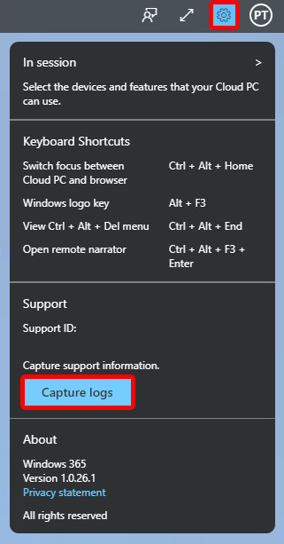

# Get your users started with Cloud PCs

After licenses are assigned, let your users know that there are two different ways in which they can access their Cloud PCs:

- Windows 365 home page [(https://windows365.microsoft.com)](https://windows365.microsoft.com)
- Microsoft Remote Desktop client

## Windows 365 home page

Users can navigate to [https://windows365.microsoft.com](https://windows365.microsoft.com) to access their Cloud PCs.

On their Windows 365 home page, users see the Cloud PCs they have access to in the **Your Cloud PCs** section.

Users can select **Open in browser** to open their Cloud PC.

> [!NOTE]  
> Mobile devices aren’t currently supported for using a browser to open Cloud PC. The Remote Desktop app is supported.

### User actions

While on the Windows 365 home page, users can take actions on their Cloud PCs. To do so, they can select the gear icon on a Cloud PC card.

- **Restart**: Restarts the Cloud PC.

- **Reset**:
  - Reinstalls Windows (with the option to choose between Windows 11 and Windows 10).
  - Removes your personal files.
  - Removes any changes you made to settings.
  - Removes your apps.

    > [!IMPORTANT]  
    > Before resetting your Cloud PC, make sure to back up any important files you need to keep to a cloud storage service or external storage. Resetting your Cloud PC will delete these files.

- **Rename**: Changes the name of the Cloud PC shown to the user on the Windows 365 home page.

- **Troubleshoot**: Troubleshoot and attempt to fix any issues that may be keeping a user from connecting to their Cloud PC. The following table describes the statuses that can result from the checks.

    | Status | Description |
    |:-----|:-----|
    |No issues detected |None of the checks ran discovered an issue with the Cloud PC. |
    |Issues resolved |An issue was detected and fixed. |
    |Can’t connect to Cloud PC. We’re working to fix it, try again later. |A Microsoft service required for connectivity is unavailable. Try connecting again later. |
    |We couldn’t fix issues with your Cloud PC. Contact your administrator. |An issue was detected but it was unable to be fixed. This issue could be caused by an ongoing Windows update or another issue. If this error persists for an extended period of time, the Cloud PC may need to be reset. |

- **System Information**: Displays information about the Cloud PC specification.

## User feedback

Users can provide feedback about their Cloud PC experience by using the feedback icon in the upper right corner.

## Collect user logs

Users can collect logs of their Cloud PC sessions. The logs are collected from the browser and the user can choose the save location.

To turn on log collection, in the client, select the gear icon > **Capture logs**.

   

## Remote Desktop

The Microsoft Remote Desktop app lets users access and control a remote PC, including a Cloud PC. Windows 365 users can download and install the Remote Desktop client from the Windows 365 home page.

### Install the Microsoft Remote Desktop app

To set up their Remote Desktop client, users follow these steps:

1. On the **Windows 365 home page**, select the **Microsoft Remote Desktop apps** icon (under the home icon).
2. On the **Microsoft Remote Desktop apps** page, download and install the Remote Desktop app you need.

   

For a list of clients by operating system, see [Remote Desktop clients](/windows-server/remote/remote-desktop-services/clients/remote-desktop-clients).

## Next steps

[Users installing apps](business/apps-install.md) 

[Manage your Cloud PCs](business/device-management.md)

[Set up Microsoft Teams in your small business](/microsoftteams/deploy-small-business)
