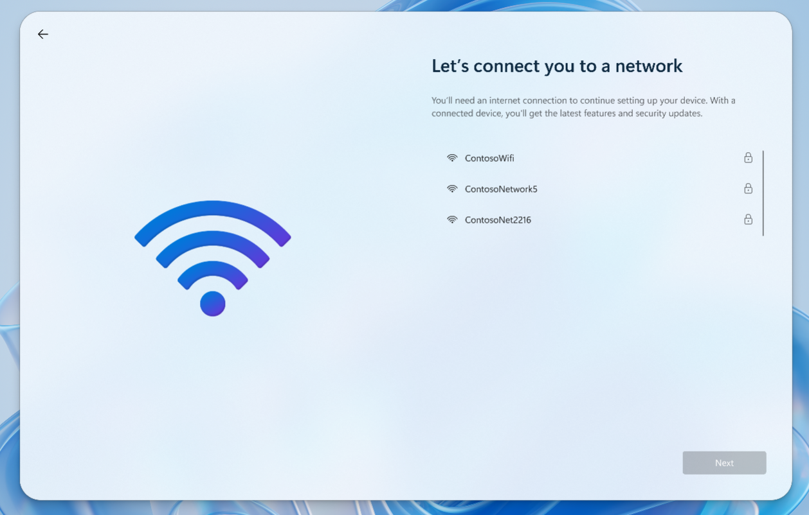
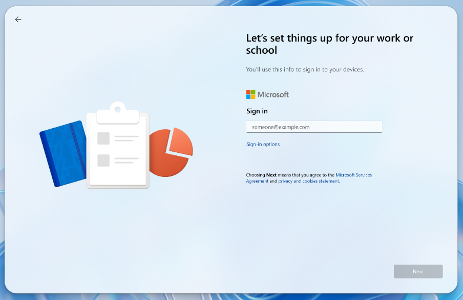

---
# required metadata
title: Set up NXT
titleSuffix:
description: Learn how to set up your NXT
keywords:
author: ErikjeMS  
ms.author: erikje
manager: dougeby
ms.date: 11/19/2024
ms.topic: overview
ms.service: windows-365
ms.subservice:
ms.localizationpriority: high
ms.assetid: 

# optional metadata

#ROBOTS:
#audience:

ms.reviewer: sajelaci
ms.suite: ems
search.appverid: MET150
#ms.tgt_pltfrm:
ms.custom: intune-azure; get-started; intro-hub-or-landing
ms.collection:
- M365-identity-device-management
- tier2
---

# Set up your NXT and sign in

[!INCLUDE [MS confidential, draft docs](../includes/draft-doc.md)]

The first time you turn on your NXT, you're guided through setting up your device and signing in with a work or school user account.

## Requirements

- An available network.
- A work or school account.

## First time set up

Complete the following steps to set up your new device:

1. Connect a monitor, USB mouse, and keyboard to the device.
2. Connect the power adaptor to the power port and then into a power outlet.
3. Power on the device.
4. On the **Let's connect you to a network** page, select a network > **Next**.

5. On the **Let's set things up for your work or school** page, type your work or school e-mail > **Next**

6. Authenticate your account as requested. Your organization defined the authentication method (security key, cross-device passkey, or passwordless multifactor authentication).
7. You're connected to your Cloud PC with all of your context and apps just where you left off.

You can adjust additional settings prior to sign-in by using [Quick settings](quick-settings.md) in the bottom-right corner.

When you sign in for the first time, the NXT joins Microsoft Entra and automatically enrolls the device into Microsoft Intune. You organization's admins use Intune to manage both virtual machines and hardware devices, including NXT. 

<!-- ########################## -->
## Next steps

[Use Quick Settings to view and manage monitors, langauages, network connections, and more](quick-settings.md).

[Use the Control-Alt-Delete menu to mange manage tasks, connections, sign-out, or lock your NXT.](control-alt-delete.md)
